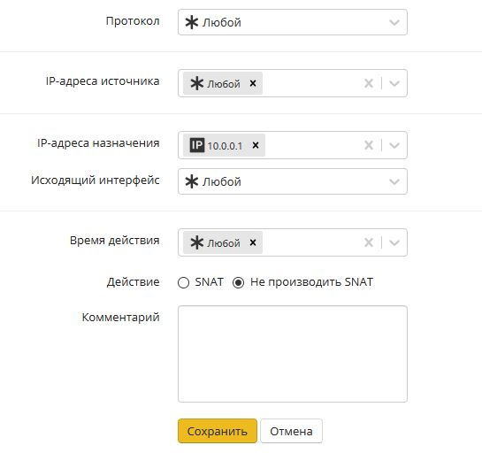
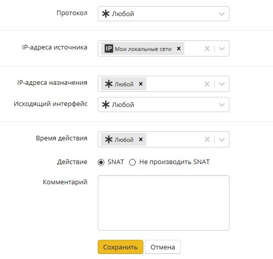
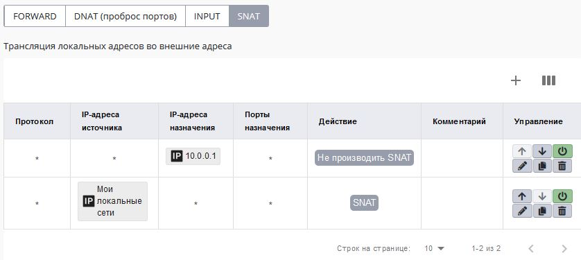

# Доступ из внешней сети без NAT

## Доступ из локальной сети во внешнюю без NAT

При необходимости (как правило, когда Ideco UTM расположен внутри
локальной сети, а не на границе с Интернетом) возможно
организовать прямой доступ в некоторым ресурсам внешних по
отношению к Ideco UTM сетей без использования NAT.

Для примера разберем настройку файрвола для доступа без NAT к IP-адресу:
**10.0.0.1** (в общем случае это также может быть сеть или диапазон
IP-адресов).

1.  Выключите параметр "Автоматический SNAT локальных сетей" в **Правила
    - Файрвол**.

2.  В файрволе в таблице SNAT создайте правило с действием "Не
    производить SNAT" для данного IP-адреса назначения.  
      
      

3.  Следующим правилом создайте правила SNAT для своей локальной сети
    (чтобы остальные хосты работали через NAT)  
    

Итоговые правила файрвола выглядят так:

На устройствах локальной сети Ideco UTM должен использоваться в качестве
основного шлюза, либо должен быть прописан необходимый маршрут к внешним
IP-адресам через Ideco UTM. Также устройства локальной сети должны быть
авторизованы на UTM.

На устройствах из внешней сети (по-отношению к Ideco UTM) также Ideco
UTM должен использоваться в качестве основного шлюза, либо иметься
маршрут к локальной сети через Ideco UTM.

## Доступ из внешней сети в локальную без NAT и фильтрации

Внимание\! Учитывайте риски подобного доступа с точки зрения
информационной безопасности. Не предоставляйте доступ для
сетей и хостов в безопасности которых вы не уверены.

При необходимости вы можете разрешить доступ с хостов или из сетей
расположенных во внешней относительно Ideco UTM сети в локальную
сеть с прямым обращением к локальным IP-адресам.

Для примера разберем настройку файрвола разрешающую хосту 10.0.0.1
доступ к локальной сети.

1.  В консоли UTM ([доступ по SSH](./Удаленный_доступ_по_SSH.md)) ввести
    команду:  
    mount -o remount,rw /
2.  Ввести команду для редактирования файла  
    `mcedit /usr/bin/ideco-static-firewall`
3.  Между строками:  
    iptables -A FORWARD -m state --state INVALID -j smart\_drop  
    iptables -A FORWARD -j forward\_sys\_rules  
    Вписать строки:  
    iptables -A FORWARD -d **10.0.0.1** -j ACCEPT  
    iptables -A FORWARD -s **10.0.0.1** -j ACCEPT
4.  Сохраните файл
5.  Перезагрузите Ideco UTM

Внимание\! После обновления Ideco UTM в некоторых случаях процедуру
данной ручной настройки придется повторить.

## Attachments:

[nosnat.jpg](attachments/4982174/4982173.jpg) (image/jpeg)  
 [не
snat.JPG](attachments/4982174/11239482.jpg) (image/jpeg)  

[snat.JPG](attachments/4982174/11239490.jpg) (image/jpeg)  
 [SNAT
итого.JPG](attachments/4982174/11239493.jpg) (image/jpeg)  
 [SNAT
итого.JPG](attachments/4982174/11239492.jpg) (image/jpeg)  
 [не производить
SNAT.JPG](attachments/4982174/12025894.jpg) (image/jpeg)  
 [SNAT
таблица.JPG](attachments/4982174/12025896.jpg) (image/jpeg)  

