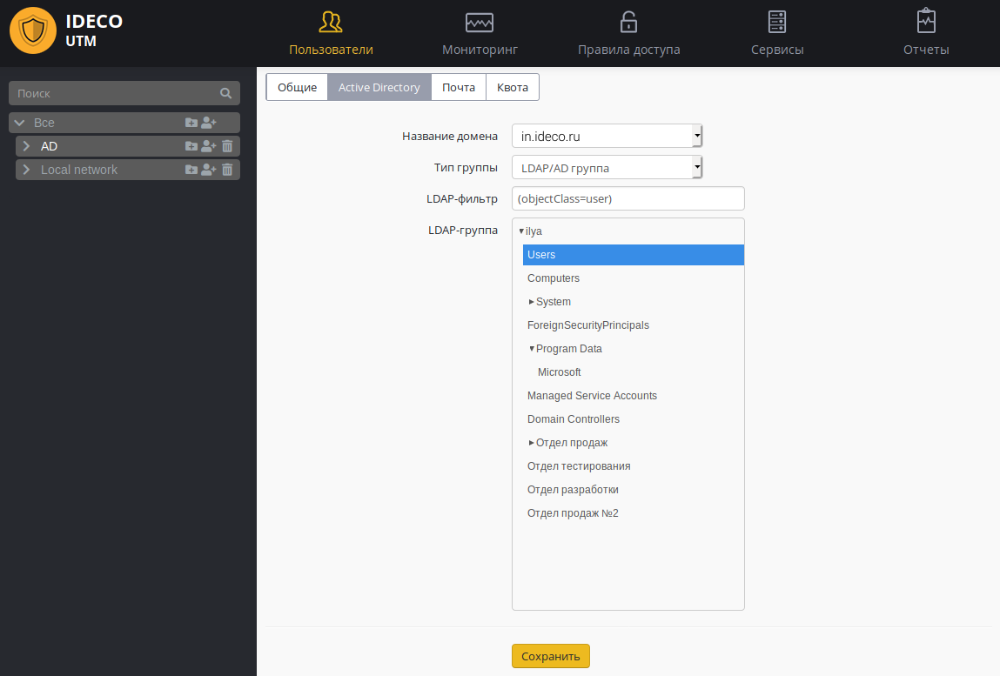
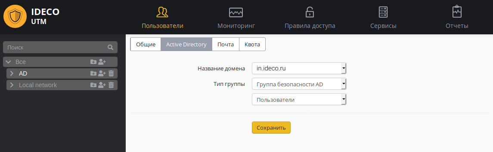

# Импорт пользователей

## Импорт учетных записей из LDAP

В Ideco UTM реализована возможность рекурсивного импорта учетных записей
из LDAP-каталога Active Directory. Импорт осуществляется по протоколам
LDAP/LDAPS (протокол LDAPS не требует дополнительных настроек со стороны
UTM и будет использоваться автоматически в случае необходимости и
использования его на контроллере домена).

Импортировать группы пользователей AD можно в специально созданные
группы пользователей в Ideco UTM. Их название может быть
произвольным.

1.  Создайте группу в дереве пользователей Ideco UTM.
2.  Выберите эту группу в дереве и перейдите на вкладку Active
    Directory.
3.  Выберите домен, из которого вы хотите импортировать пользователей
    (если Ideco UTM является членом нескольких доменов).
4.  В поле "Тип группы" выберите LDAP/AD группа.
5.  При нажатии на поле "LDAP группа" откроется дерево
    пользователей Active Directory. Выберите из него
    необходимую группу для импорта (также можно выбрать корневую
    группу для импорта всего дерева).
6.  При нажатии на кнопку "Сохранить" будет произведен импорт
    пользователей (это может занять несколько минут). В
    дальнейшем пользователи будут автоматически синхронизироваться
    с Active Directory каждые 15 минут.  
    

При необходимости можно воспользоваться фильтром запросов. Например,
если у вас в одних и тех же контейнерах находятся и пользователи, и
компьютеры, а вы хотите импортировать только пользователей, то в поле
"фильтр" нужно написать следующий текст:
`(&(objectCategory=person)(objectClass=user))`.

Можно импортировать разные группы пользователей AD в различные группы
Ideco UTM, для удобства назначения на них правил [файрвола](./Файрвол.md),
[контентной фильтрации](./Контент-фильтр.md), [контроля приложений](./Контроль_приложений.md), [ограничения полосы пропускания](./Ограничение_скорости.md) и других модулей.

## Импорт учетных записей из групп безопасности

Возможен импорт пользователей из групп безопасности Active Directory.
При этом, если вы импортируете несколько групп безопасности в разные
папки на Ideco UTM, а пользователь в Active Directory находится в
нескольких импортируемых группах безопасности, в Ideco UTM он
будет импортирован только в одну группу.

1.  Создайте группу в дереве пользователей Ideco UTM.
2.  Выберите эту группу в дереве и перейдите на вкладку Active
    Directory.
3.  В поле "Имя домена" выберите нужный домен.
4.  В поле "Тип группы" выберите "Группа безопасности AD".
5.  В поле ниже выберите нужную группу безопасности.
6.  Нажмите на кнопку "Сохранить".  
    

Можно импортировать любое количество групп безопасности AD в разные
папки в дереве пользователей Ideco UTM.

Пользователь Active Directory может быть импортирован только в одну
группу Ideco UTM. Поэтому если он находится в нескольких группах
безопасности Active Directory, при импорте он попадет только в
какую-то одну группу в UTM.

## Attachments:

[синхронизация.png](attachments/6356999/11436092.png)
(image/png)  
 [группа
безопастности.png](attachments/6356999/11436094.png)
(image/png)  
 [ГБ
AD.png](attachments/6356999/11436096.png) (image/png)  

