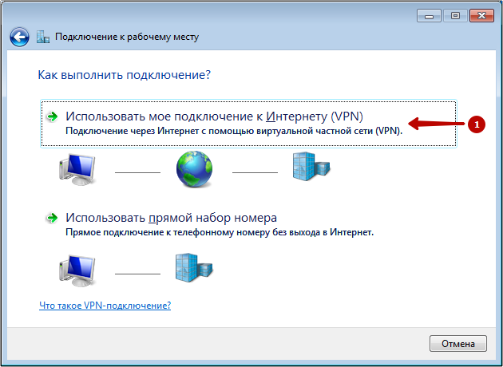
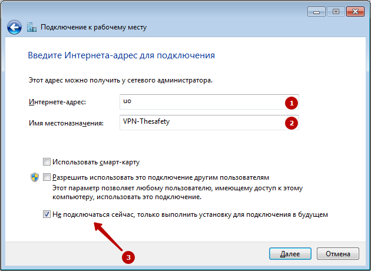
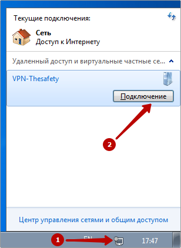

# Инструкция по созданию подключения в Windows 7

Вам потребуется доменное вашего сервера (можно получить у системного
администратора) и учетные данные пользователя (логин/пароль).

1.  Откройте Центр управления сетями и общим доступом.  
    
2.  Выберите Настройка нового подключения или сети.  
    
3.  Выберите Подключение к рабочему месту.  
    
4.  Выберите Использовать мое подключение к Интернету (VPN).  
    
5.  Введите доменное имя сервера в качестве адреса подключений.  
    Имя местоназначения может быть произвольным.  
      
    
6.  Введите ваш логи и пароль  
    
7.  Нажмите "Закрыть"  
    
8.  Выберите Подключение к IKEv2 VPN серверу в Windows 7.  
    
9.  Выберите Свойства.  
    
10. Выберите протокол IKEv2 и обязательное шифрование.  
    
11. Подключитесь к IKEv2 VPN серверу в Windows 7.  
    

## Attachments:

[windows7-ikev2vpn-ru-1.png](attachments/17072171/17072204.png)
(image/png)  

[windows7-ikev2vpn-ru-2.png](attachments/17072171/17072206.png)
(image/png)  

[windows7-ikev2vpn-ru-3.png](attachments/17072171/17072207.png)
(image/png)  

[windows7-ikev2vpn-ru-4.png](attachments/17072171/17072208.png)
(image/png)  

[windows7-ikev2vpn-ru-5.png](attachments/17072171/17072209.png)
(image/png)  

[windows7-ikev2vpn-ru-6.png](attachments/17072171/17072210.png)
(image/png)  

[windows7-ikev2vpn-ru-7.png](attachments/17072171/17072211.png)
(image/png)  

[windows7-ikev2vpn-ru-8.png](attachments/17072171/17072212.png)
(image/png)  

[windows7-ikev2vpn-ru-9.png](attachments/17072171/17072214.png)
(image/png)  

[windows7-ikev2vpn-ru-11.png](attachments/17072171/17072215.png)
(image/png)  

[windows7-ikev2vpn-ru-12.png](attachments/17072171/17072216.png)
(image/png)  

