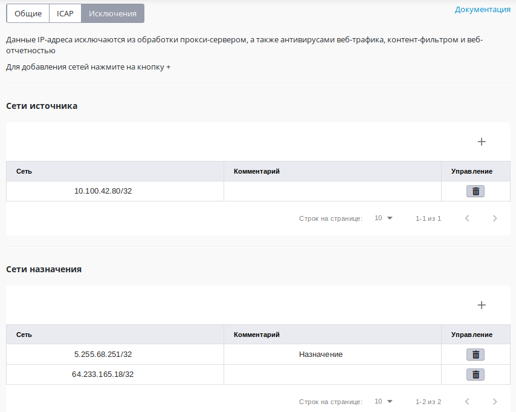

# Исключить IP-адреса из обработки прокси-сервером

В разделе ******«****Исключения****»****** службы
******«****Прокси**»**** можно настроить исключение трафика
отдельных пользователей или трафика к определенным ресурсам в
Интернет из прохождения и обработки веб-прокси, имеющегося в
составе UTM.

Исключения ресурсов из обработки прокси-сервером работают только для
прозрачного режима прокси. При прямых подключениях к прокси-серверу
исключить что-либо из обработки прокси нельзя.

Можно настроить два типа исключений:

  - Исключение трафика хостов локальных сетей UTM направленного вовне из
    обработки прокси (**Сети источника**).
  - Исключение трафика всех хостов в локальной сети, обслуживаемой UTM
    до определенных ресурсов в внешних сетях (**Сети назначения**).

Указывать можно только IP-адреса или IP-сети.

Трафик, исключенный из обработки прокси, не будет участвовать в
****«**Отчетах**»****, а также не может быть проверен на вирусы и
обработан модулем ****«**Контент-фильтра**»****.  
В то же время такой трафик будет проверен файрволом, службами
предотвращения вторжений и контролем приложений.

 

### Программы работающие по протоколам, отличным от HTTP(S) через веб-прокси

Некоторые программы, отправляющие трафик на свои серверы по портам 80 и
443, но при этом работающие по протоколам, отличным от HTTP(S), не могут
быть обработаны веб-прокси сервером на UTM с включенной фильтрацией
HTTPS трафика.  
Трафик таких программ следует исключать из обработки прокси в поле
**«Сети назначения**»****.

**Сети **«**1с Коннект**»****

    185.104.248.141/32
    77.244.213.204/32
    185.188.183.87/32
    185.24.93.122/32
    185.143.172.61/32

 

**Сети **«**ВЭД-Декларант****»******

    212.49.126.110/32
    46.48.116.196/32
    94.213.21.144/32
    194.213.21.144/32
    91.220.57.3/32

## Attachments:

[proxy\_bypass.jpg](attachments/1278144/5832777.jpg) (image/jpeg)  

[4\_exceptions.png](attachments/1278144/6586805.png) (image/png)  

[Исключение.png](attachments/1278144/12025875.png)
(image/png)  

