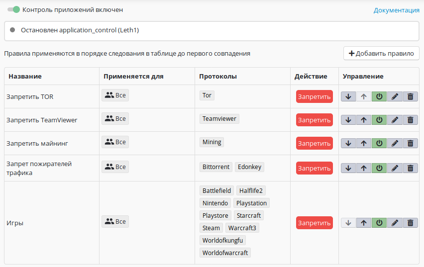

# Контроль приложений

Данный модуль осуществляет глубокий анализ трафика (Deep Packet
Inspection - DPI) для выявления протоколов популярных приложений
(layer-7 фильтрация).

В связи с частыми обновлениями ПО модуль не всегда может верно
определить трафик нужного приложения, такое поведение будет
исправлено в следующих версиях Ideco UTM.

Статус модуля показывается в левом верхнем углу окна настроек.

Контроль приложений работает только в редакции Enterprise у
пользователей с активной подпиской на обновления и
техническую поддержку, а также в редакции [Ideco
SMB](https://smb.ideco.ru) с приобретённым модулем.

Список совместимых сетевых адаптеров, с которыми точно работает данный
модуль, находится в [системных требованиях](./Системные_требования.md).

Принцип действия набора правил контроля приложений аналогичен правилам
межсетевого экрана:

  - Приоритет правила выше, чем выше расположено правило в списке.
  - Просмотр правил осуществляется до первого срабатывания правила.

Приоритет правила можно изменять, нажимая кнопки со стрелками в колонке
"Действия".

## Создание правила

При создании нового правила укажите следующие параметры:

**Название** - название правила, для удобства администрирования.

**Применяется для** - пользователь, группа пользователей или специальный
объект "Превышена квота" (более подробно в разделе "[Пользовательские квоты](./Пользовательские_квоты.md)"). Правило будет применено для всех
пользователей, соответствующих данной метке.

**Протоколы** - протоколы 7-го уровня (приложения).

**Доступ** - разрешить или запретить данный протокол.  
  

Для применения настроек модуля нажмите кнопку "Применить изменения",
чтобы они вступили в силу.

 

## Attachments:

 [контроль
приложений.JPG](attachments/4982467/4982972.jpg)
(image/jpeg)  

[КП.png](attachments/4982467/11436182.png) (image/png)  

