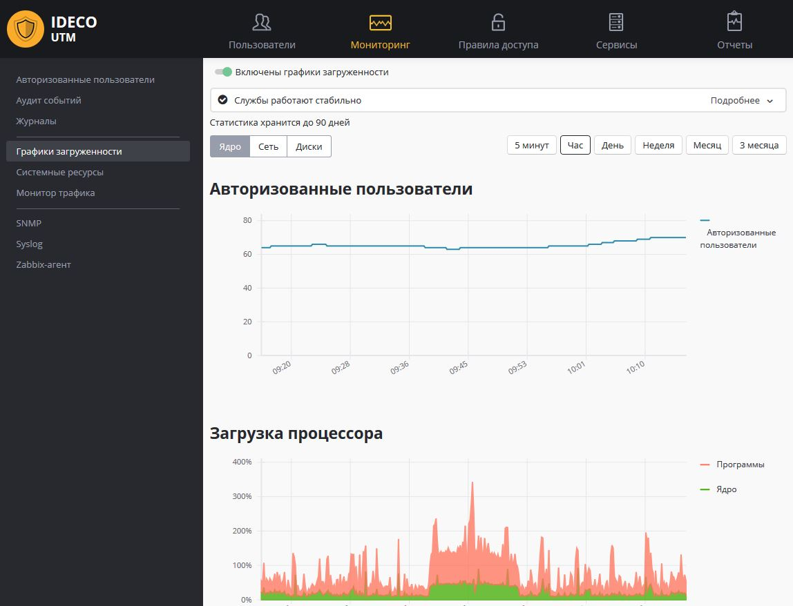

# Мониторинг

В разделе «Мониторинг» веб-интерфейса Ideco UTM можно получить данные о
авторизованных на сервере пользователях, загрузки процессора и
интерфейсов, а также посмотреть данные о трафике в режиме
реального времени.

Интеграция с внешними системами мониторинга и анализа системных логов,
описана в данном разделе документации.

## Attachments:

[мониторинг.JPG](attachments/6586428/7110836.jpg)
(image/jpeg)  

