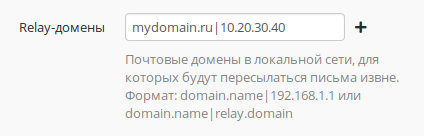

# Настройка почтового релея для публикации сервера в локальной сети

Если Ideco UTM имеет внешний IP-адрес и на него зарегистрирован домен и
настроены необходимые записи у регистратора и провайдера, но вы хотите
чтобы отправкой и доставкой почты занимался другой сервер (к примеру
заранее настроенный Exchange сервер в локальной сети), то Ideco UTM
может ретранслировать всю входящую почту на эту машину.

Перед настройкой почтового релея убедитесь что на Ideco UTM включен
почтовый сервер.  
Для этого включите встроенную почту по POP3 или IMAP протоколу в разделе
веб-интерфейса ***Сервисы -\> Почтовый сервер -\> Общие*** и сохраните
настройки.

Для настройки почтового релея добавьте в поле "Relay-домены" запись
вида: mydomain.ru|10.20.30.40, где:

mydomain.ru - ваш почтовый домен, зарегистрированный в Интернете на
публичный адрес Ideco UTM.

10.20.30.40 - адрес вашего почтового сервера в локальной сети.

При настройке почтового релея на Ideco UTM принципиально, чтобы основной
почтовый домен Ideco отличался от Relay-домена. Для этого в поле
***Основной почтовый домен*** в настройках почтового сервера нужно
прописать вымышленный домен не совпадающий с зарегистрированным. Таким
образом можно указать несколько Relay-доменов для нескольких разных
серверов в локальной сети. Все почтовые домены должны быть
ассоциированы с внешним адресом сервера Ideco UTM (A и MX
записи в DNS-зоне).

При такой схеме Ideco UTM будет пропускать, проходящую через себя, почту
прямо на почтовый сервер в локальной сети. Попутно письма могут
проверяться на вирусы и спам, просто включите соответствующие
сервисы в веб-интерфейсе Ideco UTM.

Ideco UTM будет принимать почту, адресованную только для указанного
Relay-домена. Любая другая почта будет отвергнута сервером, таким
образом возможность получения открытого почтового релея при
настройке исключена.

## Attachments:

[mail\_relay.png](attachments/1278147/1441943.png) (image/png)  

[relay.png](attachments/1278147/11436173.png) (image/png)  

[relay.png](attachments/1278147/6062142.png) (image/png)  

