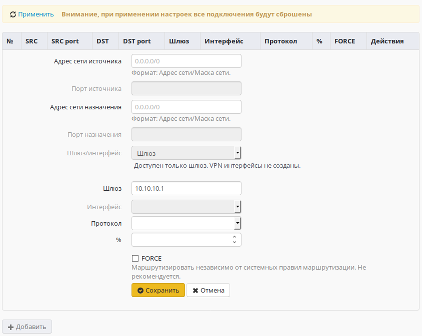
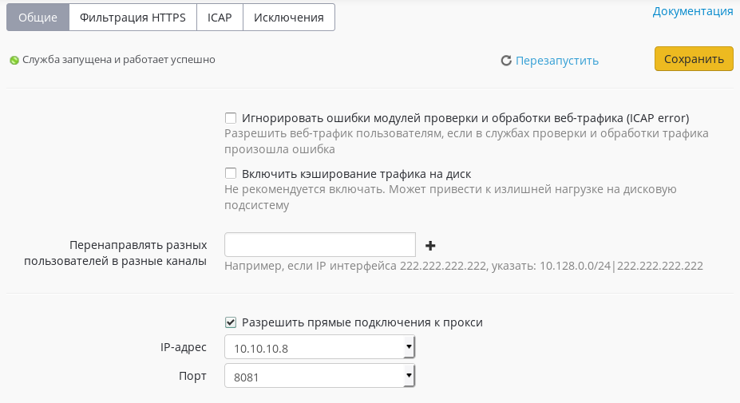

# Настройка прокси с одним интерфейсом

При необходимости можно использовать Ideco UTM в качестве прокси-сервера
с прямыми подключениями клиентов к прокси, с одним интерфейсом.

Для этого необходимо выполнить следующие настройки:

1.  На вкладке**«Сервисы ➔ Маршрутизация»**, создать маршрут,
    перенаправляющий весь трафик на указанный шлюз  
    В адресах сети источника и назначения должны остаться значения
    `0.0.0.0/0`.  
      
      
2.  Применить маршрут
3.  Разрешить прямые подключения к прокси-серверу на вкладке
    **«Сервисы ➔ Прокси»**, выбрав нужный порт из списка  
    

 

При использовании Ideco UTM в качестве прокси-сервера с прямыми
подключениями к прокси, большинство функций будет работать в
обычном режиме, с некоторыми особенностями:

  - Убрать предупреждение о не настроенном внешнем интерфейсе можно
    создав "пустой" сетевой интерфейс (VLAN, если отсутствует
    второй физический интерфейс на сервере) с не используемым в
    сети "серым" IP-адресом.
  - В правилах межсетевого экрана для пользователей необходимо указывать
    пути `INPUT/OUTPUT`, вместо **`FORWARD`**.
  - Глубокий анализ трафика системой предотвращения вторжений и модулем
    контроля приложений будет осуществляться только для трафика
    проходящего через прокси-сервер (часть правил работать не
    будет).
  - Исключения из прокси-сервера необходимо делать средствами браузера
    или маршрутами на конечных устройствах. Настройки на
    вкладке **«Сервисы ➔ Прокси ➔ Исключения»** применяются
    только для прозрачного режима работы прокси-сервера.

## Attachments:

[маршрут.JPG](attachments/6357079/6357082.jpg) (image/jpeg)  

[прокси.JPG](attachments/6357079/6357083.jpg) (image/jpeg)  

[5\_route\_for\_utm\_with\_1\_nic.png](attachments/6357079/6586818.png)
(image/png)  

[1\_allow\_direct\_squid\_connections.png](attachments/6357079/6586819.png)
(image/png)  
 [Screenshot from 2018-09-03
18-07-16.png](attachments/6357079/6586936.png) (image/png)  

