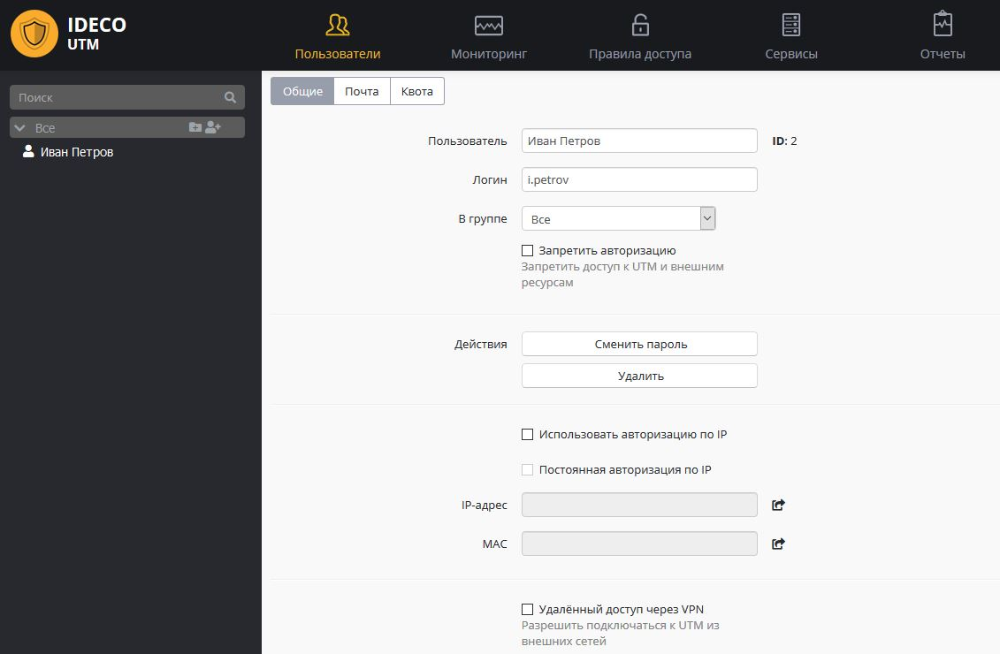

# Настройка учетных записей пользователей

Настройка пользователей осуществляется в разделе ***"Пользователи"***.
Чтобы определить параметры учетной записи пользователя, выберите её в
дереве пользователей нажатием мышью. В правой части экрана появятся
параметры выделенной учетной записи. В случае, если вы желаете
изменить параметры всех пользователей, входящих в группу, вам
нужно выделить в дереве пользователей соответствующую группу.

Все настраиваемые параметры разделены по нескольким категориям, которые
вы можете видеть в таблице ниже.

Категории параметров учетной записи пользователя

Общие

Основные параметры.

Почта

Параметры, отвечающие за создание и управление почтовым ящиком.

Квота

Информация о квотах по трафику - использованной квоте. Используется в
случае установки квот.

## Общие настройки

Раздел общих настроек включает в себя множество основных параметров,
определяющих статус учетной записи пользователя. Общие настройки
разделены на базовые и дополнительные. Начнем с рассмотрения базовых
параметров, описанных в следующей таблице.

Общие настройки (базовые параметры)

Active Directory

Признак пользователя, импортированного из Active Directory.

Пользователь

Имя пользователя, для которого создается учетная запись, например,
Иванов Иван.

Логин

Логин, который будет применяться пользователем для прохождения процедуры
авторизации в различных службах Ideco UTM. Логин необходимо вводить
латинскими символами с соблюдением регистра, например, i.ivanov.

В группе

Группа, в которую входит данный пользователь.

Запретить авторизацию

Запретить пользователю авторизоваться на шлюзе безопасности Ideco UTM.
Это означает, что он не сможет пользоваться ресурсами сети Интернет,
почтой и личным кабинетом.

Сменить пароль

Функция изменения пароля для учетной записи пользователя.

Удалить

Функция для удаления текущего пользователя.

Использовать авторизацию по IP

Для авторизации по IP-адресу.

Постоянная авторизация по IP

Параметр, который позволяет включить постоянную статическую авторизацию,
работает только в случае авторизации по IP-адресу.

IP-адрес

IP-адрес, который закреплен за данной учетной записью при авторизации по
IP-адресу.

MAC-адрес

MAC-адрес сетевого адаптера, которому назначен IP-адрес, закрепленный за
учетной записью. В случае указания, пользователь будет авторизован
только при совпадении IP и MAC-адреса.Если на Ideco UTM включен
DHCP-сервер, то автоматически будет создана статическая привязка IP к
MAC (данное устройство всегда будет получат этот IP по DHCP).

Удаленный доступ через VPN

Разрешить подключаться к серверу Ideco UTM по VPN из интернета.
Подробнее см. в разделе
"VPN".

Форма параметров пользователей показана ниже.

## Почта 

В этом разделе находятся параметры, с помощью которых для учетной записи
может быть предоставлен доступ к работе с почтовым сервером. В следующей
таблице представлен перечень параметров для настройки почтового
сервера. 

Настройки почты

Разрешить почту

Автоматически создаёт аккаунт на Почтовом сервере. Подробнее см. в
разделе "[Почтовый сервер](./Почтовый_сервер.md)".

Почтовый логин

 Не обязательно. Этот параметр позволяет задать пользователю название
почтового ящика, отличное от его логина.

Автоответчик для почты

Активирует автоответчик на почтовом ящике.

## Квота

Данный раздел позволяет просматривать и увеличивать квоту пользователя,
в случае использования лимитов трафика. Настройка квот трафика описана
в соответствующем разделе документации:
[Квоты](./Пользовательские_квоты.md).

## Attachments:

 [image2017-12-11
10:13:46.png](attachments/1278059/5832768.png) (image/png)  

[users.JPG](attachments/1278059/7110720.jpg) (image/jpeg)  

[user.JPG](attachments/1278059/11239479.jpg) (image/jpeg)  

