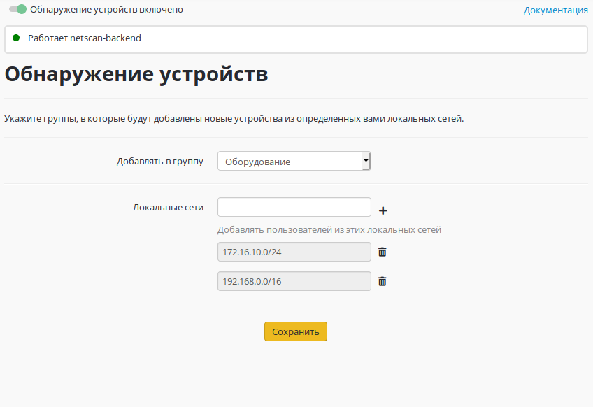

# Обнаружение устройств

Включение данного модуля предоставляет возможность автоматического
создания пользователя с [авторизацией по IP-адресу](./Авторизация_по_IP-адресу.md) для устройства,
пытающегося выйти в Интернет через Ideco UTM.  
Пользователь будет автоматически создан при попытке выхода в Интернет
(данный модуль не осуществляет сканирования сети в поисках устройств,
а работает в пассивном режиме).

Пользователи будут  создаваться в указанной группе с именем,
соответствующим IP-адресу или NetBIOS-имени компьютера.  
При необходимости можно ограничить локальные сети, пользователи из
которых будут автоматически добавлены и авторизованы на Ideco UTM.
Например, таким образом можно авторизовать пользователей, подключающихся
по Wi-Fi или другой открытой сети.

## Attachments:

[поиск-устройств.JPG](attachments/4982890/4982965.jpg)
(image/jpeg)  

[1\_device-search.png](attachments/4982890/6586634.png) (image/png)  

[Обнаружение.png](attachments/4982890/12025888.png)
(image/png)  

