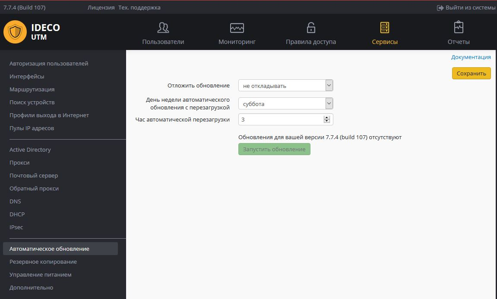
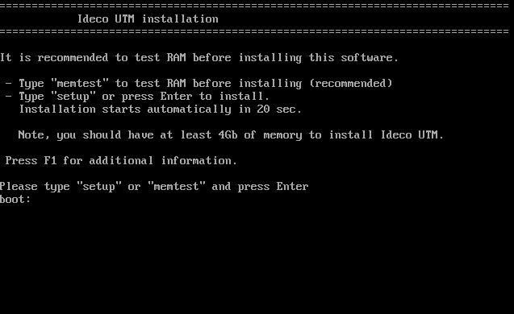
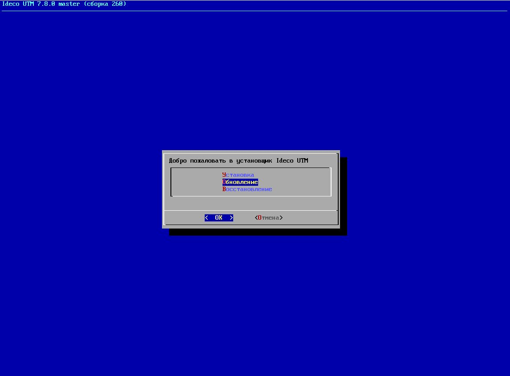
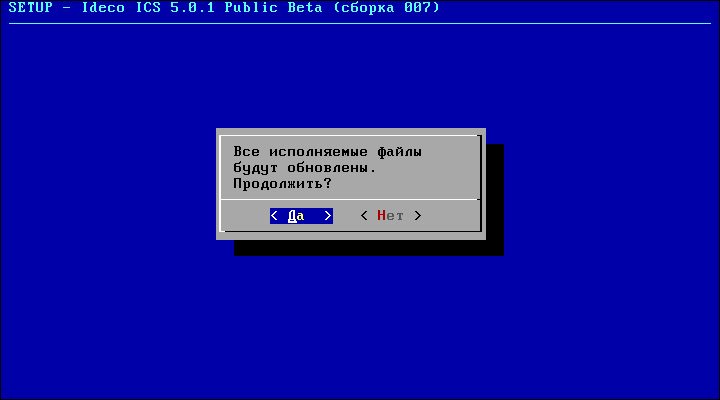

# Обновление сервера

  - [Автоматическое
    обновление](#id-Обновлениесервера-Автоматическоеобновление)
  - [Обновление сервера с помощью установочного
    диска](#id-Обновлениесервера-Обновлениесервераспомощьюустановочногодиска)
  - [Устаревшие версии Ideco
    UTM](#id-Обновлениесервера-УстаревшиеверсииIdecoUTM)

Обновление с версий **6.х** и более ранних, до актуальной версии
невозможно. Рекомендуется чистая установка новой версии.  
**Обновление до версии 7.1.0 и более новых возможно только с версии
[7.0.4](http://iso-images.ideco.ru/ics/IdecoICS_704_109_all.iso) и после
[регистрации сервера](./Регистрация_сервера.md) в личном кабинете.**

## Автоматическое обновление

Автоматическое обновление инкрементальное - не требуется скачивание
объема целого образа, загружаются только измененные данные.

Автоматическое обновления происходит с ближайших версий до текущей.
Обновление с относительно старой версии на текущую может
происходить поэтапно с промежуточными версиями. В этом случае
требуется производить обновление до тех пор, пока интерфейс не сообщит
"На сервере нет обновлений для вашей версии".

Параметры автоматического обновления настраиваются в разделе Сервер -
Автоматические обновления. Выберите день недели и час автоматического
обновления (в это время сервер будет перезагружен). Можно отложить
обновления на срок до 6 месяцев, с даты выхода нового релиза.
Также есть возможность запустить механизм принудительного
обновления, не дожидаясь расписания, нажав на кнопку в
интерфейсе "Запустить обновление".

При инициировании принудительного обновления будет произведена загрузка
обновления, после чего потребуется полная перезагрузка UTM.

 

  - Во время обновления сервера может происходить реструктуризация базы
    данных. Не допускайте перезагрузку сервера в этот момент - это
    приведет к увеличению времени на данную процедуру.
  - Во время применения патчей при перезагрузки сервера на локальном
    экране могут появляться вопросы о замене файлов. На них
    требуется отвечать клавишей "Y", если вы хотите продолжить
    обновление с заменой всех ручных изменений конфигурационных файлов.

После проведения обновления номер новой версии будет отображаться в
верхних левых углах локальной консоли и веб-интерфейса
администратора.

После обновления сервера обязательно **очистите кэш браузера** до входа
в веб-интерфейс Ideco UTM, иначе он может работать не корректно.

Автоматическое обновление на последнюю версию всегда выходит после
выпуска версии, а не одновременно. Если на сайте имеется новая
версия, а интерфейс сообщает, что на сервере нет новых обновлений,
то нужно подождать выхода обновления, оно становится постепенно, а не
одновременно доступным всем пользователям.

## Обновление сервера с помощью установочного диска

Прежде всего вам нужно скачать CD-образ (.iso) с сайта нашей компании и
записать его на CD или USB-flash. Актуальная версия образа доступна на
[этой странице](http://ideco.ru/obtain/ics).

Также возможно обновление системы с USB-Flash:
[инструкция](https://ideco.ru/assets/files/Create_USB_Flash.pdf)
по созданию загрузочного USB-flash диска.

Для проверки того, что ваша копия образа была скачана с сайта без ошибок
и корректно записана на CD, нужно сравнить полученный образ и образ,
записанный на диск, на соответствие хеш-суммы MD5. MD5-хеш
опубликованного файла образа указан на странице загрузки
iso-образа.

Записанный установочный диск вставьте в DVD-ROM вашего сервера, либо
вставьте USB-flash диск в USB-порт.

Убедитесь, что в BIOS выбрана загрузка с DVD-ROM / USB.

В начале процесса обновления вы увидите приглашение загрузчика Ideco
UTM. Не выбирайте никаких дополнительных опций, нажмите "***Enter***".
Загрузчик показан на снимке экрана ниже.

Далее система предлагает вам выбрать тип установки. Подробную информацию
о возможных вариантах загрузки вы можете найти в разделе "Установка". В
случае обновления сервера выберите пункт "***Обновление***" и нажмите
"***OK***". Меню выбора типа установки показано ниже. 

Система предупреждает о том, что в процессе обновления старые версии
всех системных файлов заменяются на новые с установочного диска.
Предупреждение об обновлении файлов приведено ниже. Все настройки,
которые были произведены на сервере (настройки сервера и
пользователей, контент сайтов на сервере, статистика и
т.д.), останутся неизменными. Конфигурационные файлы будут обновлены
при первой загрузке сервера. Для продолжения нажмите "***Да***". 

Процесс обновления файлов запустится в автоматическом режиме и может
занять несколько минут.

Завершающим шагом является перезагрузка компьютера. Нажмите кнопку
"***OK***".

## Устаревшие версии Ideco UTM

[6.6.3 build 100](http://iso-images.ideco.ru/ics/IdecoICS_663_100.iso) -
на данную версию можно бесплатно обновиться с версий 6.х, даже при
окончании подписки на обновления.

[7.0.4
build 109](http://iso-images.ideco.ru/ics/IdecoICS_704_109_all.iso) -
версия Ideco ICS, с которой возможно (после регистрации) обновление
сервера до версии 7.1 и более поздних. На данную версию можно
бесплатно обновиться с версий 6.х, даже при окончании подписки
на обновления.

[7.7.4 build 107](http://iso-images.ideco.ru/utm/IdecoUTM_774_107.iso) -
версия Ideco UTM с возможностью обновиться до нее загрузившись с диска
(с версий 7.5 и старше).

## Attachments:

[cdupdate\_0.png](attachments/1278135/1441933.png) (image/png)  

[cdupdate\_1.png](attachments/1278135/1441934.png) (image/png)  

[cdupdate\_2.png](attachments/1278135/1441935.png) (image/png)  

[cdupdate\_3.png](attachments/1278135/1441936.png) (image/png)  

[cdupdate\_4.png](attachments/1278135/1441937.png) (image/png)  

[cdupdate\_6.png](attachments/1278135/1441939.png) (image/png)  
 [автоматическое
обновление.JPG](attachments/1278135/6586377.jpg)
(image/jpeg)  

[01-setup.JPG](attachments/1278135/6587110.jpg) (image/jpeg)  

[02-setup.JPG](attachments/1278135/6587111.jpg) (image/jpeg)  

[03-setup.JPG](attachments/1278135/6587114.jpg) (image/jpeg)  

