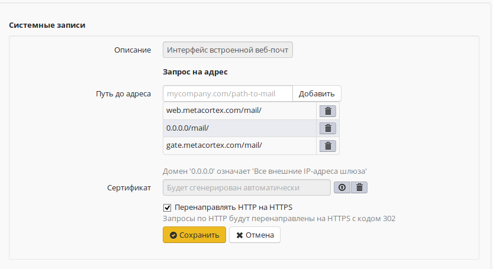
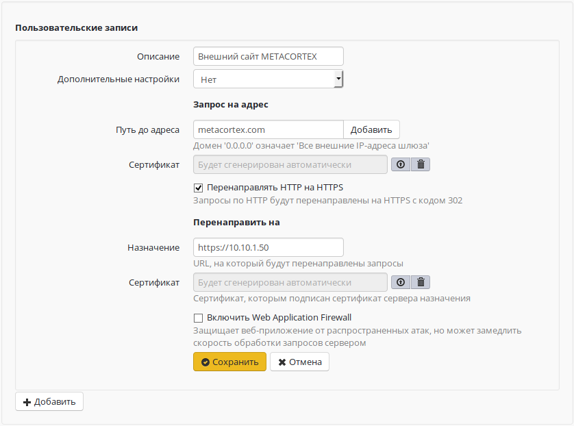
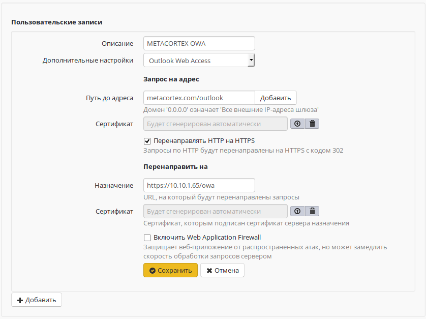

# Обратный прокси

Технология обратного прокси (реверс-прокси, reverse-proxy) позволяет
проксировать веб-трафик в обратном направлении: из сети Интернет в
локальную сеть, в отличие от наиболее часто используемого варианта
— из локальной сети в Интернет.  
Обратное проксирование применяется для публикации веб-ресурсов,
размещенных в локальной сети, таким образом, чтобы они стали
доступны потребителям из сети Интернет. Такой подход заменил
портмаппинг (DNAT) и расширил возможности по публикации
**веб-ресурсов**. 

Для публикации веб-ресурсов в локальной сети (по портам 80 и 443) всегда
используйте обратный прокси. **Не используйте портмаппинг (DNAT) в
файрволе.**

Обратный прокси отличается от DNAT тем, что работает на более высоком
уровне (прикладной протокол HTTP вместо сетевого протокола IP) и
позволяет более гибко реализовать публикацию ресурсов. Основным
параметром при публикации веб-ресурса является «входящий URL». Из
внешней сети по протоколу HTTP и данному URL будет произведено
обращение на UTM. Обратный прокси позволяет «смаршрутизировать»
(http-routing) такой запрос на HTTP-сервер в локальной сети. Таким
образом, имея одну ресурсную A-запись для внешнего сетевого
интерфейса UTM, можно опубликовать несколько ресурсов в локальной
сети, распределив их по нескольким входящим URL. Если же с внешним
IP-адресом UTM ассоциировано несколько A-записей, то маршрутизация
становится еще более простой, а входящие URL - более удобными для
посетителей ресурсов.

Также обратный прокси в составе UTM позволяет перенаправлять все
HTTP-запросы на HTTPS-схему. Это нужно если, например, ваш сайт
работает только по HTTPS (современная тенденция в
веб-безопасности), но при этом вы не хотите терять
посетителей, обратившихся к вашему сайту по HTTP-схеме.

Веб-интерфейс настройки модуля достаточно прост и состоит из двух
частей:

## Системное правило для публикации веб-почты

Описывает доступ к встроенному веб-клиенту почтового сервера на UTM (*на
основе Roundcube*). Так называемая *внешняя веб-почта*. Теперь при
настройке веб-почты в разделе *"Сервер - Почтовый сервер"* вам
нужно также указать URL, с которого будет производиться роутинг на
веб-сервер, обслуживающий почтовый веб-клиент в составе UTM.  
В примере ниже это **yourdomain.ru/mail**. Учтите, что у вас должна быть
настроена A-запись для внешнего IP-адреса UTM, которая позволяет
резолвить адрес в указанный домен, чтобы была возможность
обратиться к шлюзу по этому доменному имени.  
***/mail*** - это URL, выделенный для сервиса веб-почты. Ниже мы
рассмотрим пример выделения URL ***/owa*** для публикации
exchange-сервера в локальной сети при обращении на тот же домен
***yourdomain.ru***.  
Запись вида ***0.0.0.0/URL*** нужна, чтобы веб-почта отвечала при
обращении на любой внешний IP UTM. 0.0.0.0, в данном конкретном
случае, можно читать как "любой внешний адрес UTM". Может быть удобно
при динамическом внешнем IP, выдаваемом UTM провайдером, или при
множестве настроенных внешних IP-адресов на внешних интерфейсах
UTM.  
Удалить системное правило для веб-почты нельзя.

## Блок пользовательских правил

Вы можете создать неограниченное количество правил публикации внутренних
веб-ресурсов в этом блоке.  
Ниже на фрагменте экрана приведена типичная конфигурация: Публикация
сайта в локальной сети по обращению к внешнему доменному имени
(***yourdomain.ru***) и публикация веб-интерфейса управления почтовым
сервером exchange по дополнительному URL (***website.local***).  
Для сайта в примере дополнительно производится перенаправление всех
обращений по схеме HTTP от посетителя на HTTPS.  
В верхнее поле **Сертификат** следует загружать [цепочку сертификатов](./Установка_доверенного_SSL_сертификата_на_сервер.md)
для внешнего домена, доступного из Интернет. В нижнее, если локальный
веб-сервер того требует, самоподписанный сертификат (цепочку
сертификатов) для локального домена, доступного из внутренней
сети. В большинстве случаев достаточно загрузить только внешнюю
цепочку сертифкатов.

### Публикация Outlook Web Access

Для версий Microsoft Exchange 2007, 2010 возможна публикации OWA с
помощью включения специальной дополнительной настройки - "Outlook
Web Access" при создании пользовательской записи обратного
прокси-сервера.

При этом в Exchange должна быть настроена аутентификация пользователей
через форму.

### Публикация Outlook Web Access stream

Прямой способ публикации веб-ресурсов, практический аналогичный
[DNAT](./Портмаппинг_проброс_портов_DNAT_.md), но с возможностью
использования сертификатов обратного прокси-сервера для
публикации HTTPS-ресурсов.  
Подходит для публикации Microsoft Exchange 2013 и других веб-приложений.

При создании пользовательских правил укажите в доп. настройках "Outlook
Web Access stream. В полях "Запрос на адрес" и "Перенаправить на"
укажите только домены <https://youdomain/> без остальной части
URL (она не используется при публикации этим способом).  
**При использовании данного метода возможна публикация только одного
веб-ресурса. Все остальные правила обратного прокси-сервера
одновременно с этим правилом работать не будут.**

При публикации Outlook Web Access не включайте Web Application Firewall.
Их совместная работа будет возможна в следующих версиях.

 

Если у вас имеется доверенный SSL сертификат для домена, по которому
будет идти обращение извне на публикуемый ресурс, подготовьте его
как [связку сертификатов](./Установка_доверенного_SSL_сертификата_на_сервер.md)
и поместите на UTM, загрузив в поле "Сертификат" под текстовым полем
"Домен и путь". Сертификаты нужно загружать в формате PEM.

Доменные имена, указываемые в "Домен и путь", должны резолвиться во
внешний IP сервера UTM.  
Доменные имена, указываемые в "Назначение", должны резолвиться в
IP-адреса публикуемых ресурсов самим сервером UTM.

## Attachments:

[reverse\_proxy\_01\_ng.png](attachments/4981432/4981635.png)
(image/png)  

[reverse\_proxy\_02\_ng.png](attachments/4981432/4981636.png)
(image/png)  

[owa.JPG](attachments/4981432/4982054.jpg) (image/jpeg)  

[1\_roundcube\_default\_record.png](attachments/4981432/6586619.png)
(image/png)  
 [image2018-8-22
17:47:32.png](attachments/4981432/6586620.png) (image/png)  

[2\_example\_record.png](attachments/4981432/6586621.png) (image/png)  

[3\_owa\_record.png](attachments/4981432/6586622.png) (image/png)  

