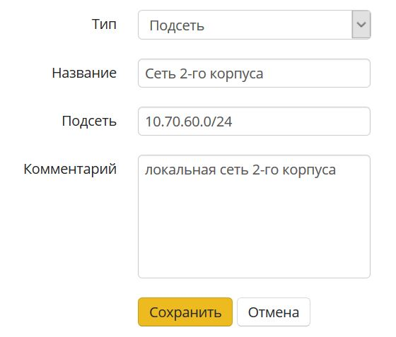

# Объекты

В разделе **Правила - Объекты**, вы можете описать объекты для
использования их в правилах [файрвола](./Файрвол.md) (а в будущих
версиях и в других модулях фильтрации трафика).

Для удобства администрирования вы можете задавать человеко-читаемые
названия для сетей, портов и диапазонов времени - применяя потом их
в правилах фильтрации.

### Типы объектов

| Название            | Описание                                                                                            | Пример данных                         |
| ------------------- | --------------------------------------------------------------------------------------------------- | ------------------------------------- |
| IP-адрес            | IP-адрес IPv4.                                                                                      | 10.0.0.1                              |
| Диапазон IP-адресов | Массив IP-адресов от 1-го до последнего указанного в диапазоне.                                     | 10.0.0.1-10.0.0.25                    |
| Подсеть             | Логический блок IP-адресации. Префикс маршрутизации выражается в нотации CIDR.                      | 10.0.0.0/24                           |
| Домен               | Символьное имя служащее для идентификации объектов в сети интернет.                                 | ideco.ru                              |
| Порт                | Натуральное число, записываемое в заголовках протоколов транспортного уровня модели OSI (TCP, UDP). | 3389                                  |
| Диапазон портов     | Массив портов от 1-го до последнего указанного в диапазоне.                                         | 1024-65535                            |
| Время               | Диапазон времени.                                                                                   | 9:00-18:00                            |
| Список адресов      | Группа объектов типа "IP-адрес"                                                                     | 10.0.0.1, 10.0.0.4, 10.0.0.126        |
| Список портов       | Группа объектов типа "Порт"                                                                         | 25, 110, 143, 445, 465, 587, 993, 995 |
| Расписание          | Группа объектов типа "Время"                                                                        | 9:00-12:00, 13:00-18:00               |

### Создание объектов

1.  Нажмите кнопку "**+**" для создания объекта.
2.  Выберите его тип, укажите название и данные объекта.  
    
3.  Нажмите кнопку "Сохранить".

Для создания групп объектов, предварительно необходимо создать сами
объекты.

Объекты типа "IP-адрес" и "Порт" можно создавать непосредственно при
создании правил [файрвола](./Файрвол.md), введя нужный IP-адрес или порт
в соответствующих полях.

## Attachments:

[объект.JPG](attachments/10616835/11436044.jpg) (image/jpeg)  

