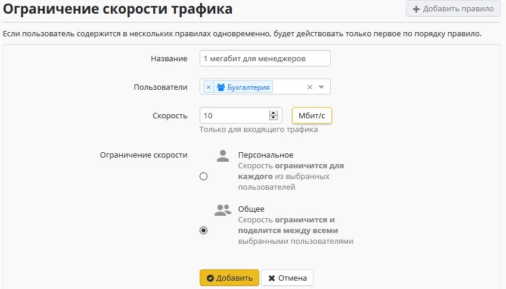
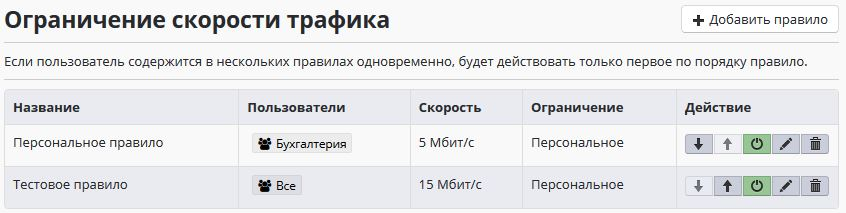

# Ограничение скорости

Служба предназначена для ограничения скорости внешнего входящего
Интернет-трафика для пользователей сети. Возможности по
ограничению исходящего трафика, а также трафика с определенных
ресурсов, будут добавлены в следующих версиях.

## Настройка ограничения скорости

Для удобства настройки существует два типа ограничения скорости. Они
могут быть применены как для отдельных пользователей, так и для
одной или нескольких групп пользователей:

  - **Персональное** - данным правилом скорость будет ограничена для
    каждого из выбранных пользователей.
  - **Общее** - скорость ограничится и поделится между всеми выбранными
    пользователями.

Например, следующее правило, примененное к группе "Отдел продаж"
приведет к тому, что лимит скорости каждого менеджера будет
равен 1 Мбит/с

В следующем примере, для всего отдела "Бухгалтерия" будет установлен
лимит скорости 10 Мбит/с. Таким образом все бухгалтера (например 10
компьютеров) не смогут одновременно скачивать файлы со скоростью более
10 Мбит/с.

## Порядок применения правил

Правила в списке ограничения скорости будут применяться до первого
сработавшего.

Например, если пользователь "Иван Петров" одновременно находится в
группе "Все" и "Бухгалтерия", то скорость для него будет
ограничена 5 Мбит/с.

При добавлении или редактировании правила, для его сохранения и
применения нажмите кнопку "Применить", находящуюся сверху над
списком правил. Настройки будут применены.

## Особенности

При подключениях пользователей по VPN к Ideco UTM из сети Интернет,
скорость трафика в локальную сеть за Ideco UTM для них может быть
ограничена в соответствии с правилами по ограничению скорости для
конечного устройства в локальной сети.

При авторизации пользователей из локальной сети по VPN правила
ограничения скорости для них применяться не будут.

 

## Attachments:

[shaper01.JPG](attachments/1703981/6586419.jpg) (image/jpeg)  

[shaper02.JPG](attachments/1703981/6586420.jpg) (image/jpeg)  

[shaper03.JPG](attachments/1703981/6586421.jpg) (image/jpeg)  

