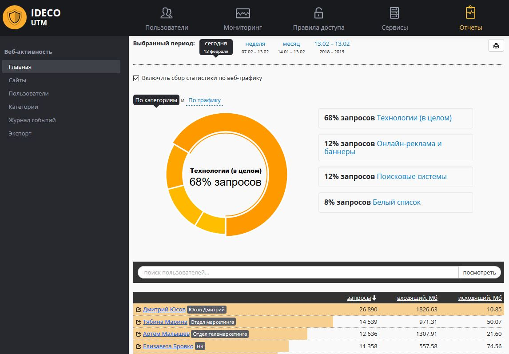

# Отчеты

# Настройка

Для доступа к отчетам нужно зайти в веб-интерфейс Ideco UTM и выбрать
модуль "**Отчеты**" в верхнем меню.

Доступ к отчетам есть у "Главного администратора", а также у
пользователей с правами "Технический администратор".

Отчетность доступна при следующих условиях:

  - На странице "Отчеты" - "Веб-активность" - "Главная" должна быть
    поставлена галочка "Включить сбор статистики по веб-трафику"
  - Должен быть включен [контент-фильтр](./Контент-фильтр.md) (даже если вы
    не собираетесь ограничивать доступ пользователям к сайтам, он
    нужен для категоризации сайтов в отчетах).

# Исключение пользователей из отчетности

Исключить пользователя из отчетов по веб-активности, можно, если
[исключить его IP-адрес из обработки прокси-сервером](./Исключить_IP-адреса_из_обработки_прокси-сервером.md).

При этом на пользователя не будут распространятся запрещающие правила
[контент-фильтра](./Контент-фильтр.md) и его трафик не будет проверяться
[антивирусами](./Антивирусы_веб-трафика.md) для веб-трафика.

## Особенности работы

  - При переводе системного времени на UTM назад или вперёд а затем
    обратно, веб-статистика за конкретный период времени (который
    включает переводы времени), в случае наличия трафика за этот
    период, будет посчитана некорректно. Это происходит из-за
    дублирования статистики за один и тот же промежуток времени.
  - Начиная с версии Ideco UTM 7.2 работа веб-отчетности возможна только
    на процессорах с поддержкой инструкций
    [SSE 4.2](https://ru.wikipedia.org/wiki/SSE4).
  - Имена удаленных из Ideco UTM пользователей в статистике не
    отображаются (статистика таких пользователей будет
    агрегирована в пользователе "удаленный пользователь").

 

## Attachments:

[отчетность1.PNG](attachments/2261141/2424889.png)
(image/png)  

[веб-отчетность.JPG](attachments/2261141/7110831.jpg)
(image/jpeg)  

