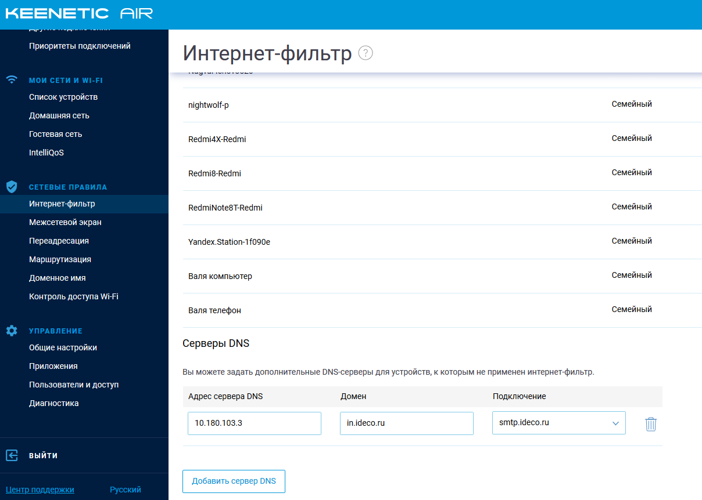

# Подключение Wi-Fi роутеров Keenetic

Вы можете подключить домашнюю сеть пользователя к VPN рабочей сети
непосредственно на роутере Keenetic.  
(если вы хотите подключить офис с Keenetic, действуйте по
[инструкции](./Подключение_Keenetic_по_SSTP.md)).

Поддерживаются все роутеры на базе KeeneticOS 3.х.х.

1.  Выполните настройку пользователей в Ideco UTM и включите SSTP в
    разделе "Сервисы" -\> "Авторизация пользователей".
2.  Зайдите в веб-интерфейс управления Keenetic:
    <http://my.keenetic.net>
3.  Установите компонент системы "Клиент SSTP": на странице "Общие
    настройки" в разделе "Обновления и компоненты", нажмите
    "Изменить набор компонентов".  
      
    Подробнее о настройках в [документации
    Keenetic](https://help.keenetic.com/hc/ru/articles/360000599979-%D0%9A%D0%BB%D0%B8%D0%B5%D0%BD%D1%82-SSTP).
4.  Создайте подключение: в разделе "Интернет" -\> "Другие подключения"
    нажмите кнопку "Добавить подключение"  
      
    Не устанавливайте флажок "Использовать для выхода в Интернет".  
    Введите имя подключения, протокол SSTP, адрес сервера (**обязательно
    укажите в адресе порт через двоеточие**), имя пользователя и пароль.
5.  В разделе "Сетевые правила" -\> "Маршруты" добавьте маршруты в вашу
    рабочую сеть.  
    Например, если сеть офиса 10.0.0.0/8, добавьте следующий маршрут:  
      
    Выберите в качестве "Интерфейса" созданное вами VPN-подключение и
    установите флажок "Добавлять автоматически", чтобы маршрут
    действовал только при активном VPN-подключении.
6.  Настройте DNS для вашего локального домена (например Active
    Directory), чтобы вы могли обращаться к ресурсам (файловым и иным
    серверам) по DNS-именам.  
    В разделе "Сетевые правила" -\> "Интернет-фильтр" -\> "Серверы DNS"
    укажите DNS-сервер вашего контроллера домена и имя домена.  
    
7.  Настойка закончена.  
    Используйте утилиту ping в командной строке для проверки связи и
    маршрутизации.  
    nslookup - для проверки резолвинга локальных имен рабочей сети.  
    В случае, если VPN работает, но до некоторых ресурсов (например
    файловых или RDP) нет связи, воспользуйтесь
    [инструкцией](./Особенности_маршрутизации_и_организации_доступа.md)
    для диагностики проблем.  
      

## Attachments:

[sstp-c-01.png](attachments/16842855/16842857.png) (image/png)  

[sstp-c-02.PNG](attachments/16842855/16842859.png) (image/png)  

[sstp-c-02.PNG](attachments/16842855/16842858.png) (image/png)  

[sstp-c-03.PNG](attachments/16842855/16842860.png) (image/png)  

[sstp-c-04.PNG](attachments/16842855/16842861.png) (image/png)  

