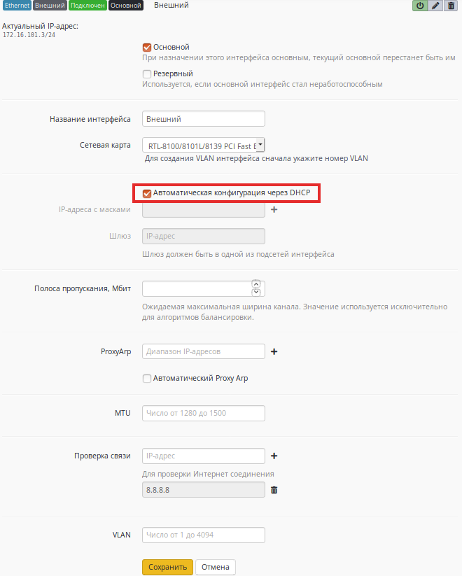

# Подключение по Ethernet

Прямое подключение по Ethernet является наиболее распространённым. Для
настройки подключения в web-интерфейсе необходимо перейти в меню
***Сервисы -\> Интерфейсы***. Вы увидите перечень существующих
сетевых интерфейсов, представленный на фрагменте экрана ниже. Для
корректной работы интернет-шлюза необходимо, как минимум, два
Ethernet-интерфейса.

Для подключения к интернет-провайдеру используется внешний интерфейс, в
то время как внутренний необходим для подключения к локальной сети
предприятия.

  

## Ручная настройка

Выберите в списке внешний Ethernet-интерфейс. Ниже на экране появятся
его параметры, которые вам необходимо определить. Перечень параметров
можно увидеть в следующей таблице. Как правило, вся необходимая
информация содержится в договоре с вашим интернет-провайдером.

| Параметр           | Описание                                                                                                                                                                                |
| ------------------ | --------------------------------------------------------------------------------------------------------------------------------------------------------------------------------------- |
| Имя интерфейса     | Укажите любое имя, с помощью которого вы будете в дальнейшем идентифицировать интерфейс, например ISP.                                                                                  |
| Включен            | Отметьте для того, чтобы активировать интерфейс.                                                                                                                                        |
| Роль               | Выберите "***Внешний***".                                                                                                                                                               |
| Сетевая карта      | Выберите из списка сетевой адаптер, который будет использоваться для подключения к интернет-провайдеру.                                                                                 |
| IP-адреса          | Вы можете назначить на интерфейс несколько IP-адресов. Для этого укажите IP-адрес, маску сети и нажмите кнопку "***Добавить***". Как минимум, должен быть указан хотя бы один IP-адрес. |
| Шлюз по умолчанию  | Укажите IP-адрес шлюза по умолчанию.                                                                                                                                                    |
| Основной           | Отметьте для того, чтобы сделать интерфейс основным.                                                                                                                                    |
| Резервный          | Отметьте для того, чтобы данный интерфейс был резервным. Трафик будет идти через него в случае не работоспособности основного интерфейса.                                               |
| Полоса пропускания | Максимальная скорость интернет-трафика по тарифу провайдера. **Введите ее только в случае необходимости использования балансировки каналов.**                                           |

Интерфейс, помеченный как основной, используется по умолчанию для
обработки трафика пользователей. Это нужно в случае, когда в
Ideco UTM создано несколько Ethernet-интерфейсов с ролью External.

Настройки внешнего Ethernet-интерфейса показаны ниже.

  

## Автоматическая настройка

Если ваш интернет-провайдер поддерживает возможность автоматической
настройки Ethernet-интерфейса с помощью протокола DHCP, то вы
можете воспользоваться им. Для этого выберите в списке внешний
Ethernet-интерфейс, параметры которого появятся на фрагменте ниже***,***
и отметьте в нём пункт ***"Автоматическая конфигурация через
DHCP-сервер"***.

 

После заполнения всех полей ещё раз убедитесь в корректности введённых
значений. Если вся информация указана верно, нажмите кнопку
"***Сохранить***" для завершения настройки подключения к
интернет-провайдеру.

Для отслеживания состояния соединения перейдите в раздел "Сервисы -
Интерфейсы". Если связь с провайдером установлена, то у интерфейса
должен появиться статус "Подключен", подсвеченный зеленым. Так же у
подключенного интерфейса всегда есть "Актуальный IP-адрес".

## VLAN

При указании VLAN ID в поле *VLAN* Ethernet-интерфейса, UTM начинает
присутствовать в этом VLAN. Такой сетевой интерфейс считается
VLAN-интерфейсом.

Можно создать неограниченное количество VLAN-интерфейсов
(Ethernet-интерфейс с указанным VLAN ID) на одном физическом
сетевом устройстве. У них в поле *Сетевая карта* может быть
назначено одно и то же устройство.

Обычные Ethernet-интерфейсы, без указания VLAN ID, создаются на
физическом интерфейсе только в единичном экземпляре.

Присутствуя в VLAN, UTM принимает трафик тегированый этим VLAN ID на
программном интерфейсе с соответствующим VLAN ID.

Пример: UTM должен присутствовать в трех VLAN локального сегмента сети
подключенного к сетевой карте на UTM (VLAN ID: 100, 101 и 102). Нужно
создать три Ethernet-интерфейса с ролью Local с указанием
соответствующих VLAN ID в поле *VLAN*. В поле *Сетевая
карта* у всех трех интерфейсов выбрать физический интерфейс
локального сегмента сети.

При этом так же может быть создан один Ethernet-интерфейс без указания
VLAN принадлежащий этому сегменту сети, который будет принимать
нетегированный трафик.

## Attachments:

[eth1.png](attachments/1278027/6586877.png) (image/png)  

[eth2.png](attachments/1278027/6586878.png) (image/png)  

[внешний.JPG](attachments/1278027/7110663.jpg) (image/jpeg)  

[Выделение\_481.png](attachments/1278027/12025863.png)
(image/png)  

[Выделение\_481.png](attachments/1278027/12025862.png)
(image/png)  

[Выделение\_483.png](attachments/1278027/12025865.png)
(image/png)  

[Выделение\_485.png](attachments/1278027/12025866.png)
(image/png)  

[Выделение\_486.png](attachments/1278027/12025868.png)
(image/png)  

