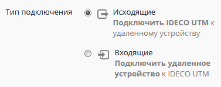
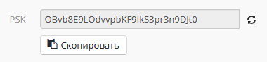
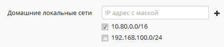
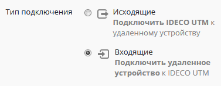
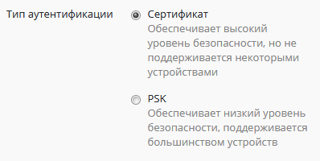
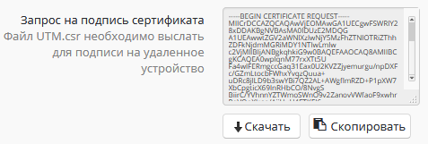
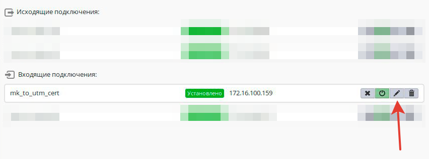
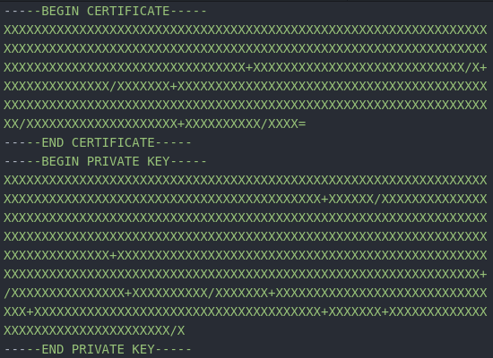

# Подключение устройств

Данный раздел предназначен для описания вариантов подключения различных
роутеров (Mikrotik, Zyxel Keenetic и др.) к Ideco UTM для организации
site-to-site VPN с использованием протокола **IPsec IKEv2**.

Не описанные в данной инструкции устройства, как правило, можно
подключить с использованием аналогичных настроек.

При объединении сетей с помощью VPN локальные сети в разных офисов не
должны пересекаться.

 

  - [Список допустимых алгоритмов шифрования и хеширования, используемых
    в Ideco
    UTM](#id-Подключениеустройств-Списокдопустимыхалгоритмовшифрованияихеширования,используемыхвIdecoUTM)
  - [Подключение Ideco UTM к MikroTik с использованием
    PSK](#id-Подключениеустройств-ПодключениеIdecoUTMкMikroTikсиспользованиемPSK)
      - [Настройка Ideco
        UTM](#id-Подключениеустройств-НастройкаIdecoUTM)
      - [Настройка Mikrotik](#id-Подключениеустройств-НастройкаMikrotik)
  - [Подключение MikroTik к Ideco UTM с использованием
    PSK](#id-Подключениеустройств-ПодключениеMikroTikкIdecoUTMсиспользованиемPSK)
      - [Настройка MikroTik](#id-Подключениеустройств-НастройкаMikroTik)
      - [Настройка Ideco
        UTM](#id-Подключениеустройств-НастройкаIdecoUTM.1)
  - [Подключение Ideco UTM к MikroTik с использованием
    сертификатов](#id-Подключениеустройств-ПодключениеIdecoUTMкMikroTikсиспользованиемсертификатов)
      - [Настройка Ideco UTM (начало
        настройки)](#id-Подключениеустройств-НастройкаIdecoUTM\(началонастройки\))
      - [Настройка
        MikroTik](#id-Подключениеустройств-НастройкаMikroTik.1)
      - [Настройка Ideco UTM (завершение
        настройки)](#id-Подключениеустройств-НастройкаIdecoUTM\(завершениенастройки\))
  - [Подключение MikroTik к Ideco UTM по
    сертификатам](#id-Подключениеустройств-ПодключениеMikroTikкIdecoUTMпосертификатам)
      - [Настройка MikroTik (начало
        настройки)](#id-Подключениеустройств-НастройкаMikroTik\(началонастройки\))
      - [Настройка Ideco
        UTM](#id-Подключениеустройств-НастройкаIdecoUTM.2)
      - [Настройка MikroTik (завершение
        настройки)](#id-Подключениеустройств-НастройкаMikroTik\(завершениенастройки\))

## Список допустимых алгоритмов шифрования и хеширования, используемых в Ideco UTM

  - aes128 (aes-128-cbc)
  - aes256 (aes-256-cbc)
  - sha256
  - sha384
  - modp1536 (DH группа: 5)
  - modp2048 (DH группа: 14)
  - modp4096 (DH группа: 16)

## Подключение Ideco UTM к MikroTik с использованием PSK

По данным шагам можно настроить подключение Ideco UTM к MikroTik, при
наличии на MikroTik "белого" IP-адреса.

### Настройка Ideco UTM

1.  В Ideco UTM откройте вкладку **Сервисы → IPSec → Устройства** и
    нажмите кнопку "Добавить подключение".

2.  В поле "**Название подключения**" укажите **произвольное имя** для
    подключения. Например, "*Подключение к Офиса в Калининграде*".

3.  В поле "**Тип подключения**" необходимо выбрать "**Исходящее**",
    поскольку осуществляется подключение от *UTM*.  
    

4.  В поле "**Тип аутентификации**" необходимо указать "**PSK**".  
    

5.  В поле "**Адрес удаленного устройства**" необходимо
    указать **внешний IP-адрес** MikroTik-а.

6.  В поле "**PSK**" будет сгенерирован случайный **PSK-ключ**. Он
    потребуется, чтобы настроить подключение в *MikroTik*-е.  
    

7.  В поле "**Домашние локальные сети**" необходимо перечислить
    все **локальные сети UTM**, которые будут доступны
    в *IPSec*-подключении, т.е. будут видны противоположной
    стороне.  
    Все локальные сети UTM, которые у вас установлены по умолчанию, уже
    перечислены в этом поле. Вам нужно всего-лишь выбрать (путем
    нажатия на ), стоит ли включать эти сети, или нет.  
    

8.  В поле "**Удаленные локальные сети**" необходимо перечислить
    все **локальные сети MikroTik-a**, которые будут доступны
    в *IPSec*-подключении, т.е. будут видны противоположной стороне.

9.  После настроек нажмите кнопку "**Сохранить**".

10. В списке подключений появится ваше новое подключение.

### Настройка Mikrotik

Настройку *MikroTik*-а можно осуществить стандартным способом,
через *GUI* либо консоль устройства.

Либо воспользовавшись нашими конфигурационными скриптами,
сгенерированными по адресу: <https://mikrotik.ideco.ru/>

После генерации скрипта необходимо открыть раздел "System → Scripts",
создать скрипт, вставить в него код, сгенерированный конфигуратором и
запустить его.

После того как скрипт закончит свою работу, никаких дополнительных
действий по настройке осуществлять не требуется.

## Подключение MikroTik к Ideco UTM с использованием PSK

По данным шагам можно настроить подключение MikroTik к Ideco UTM, при
наличии на UTM "белого" IP-адреса.

### Настройка MikroTik

Настройку *MikroTik*-а можно осуществить стандартным способом,
через *GUI* либо консоль устройства.

Либо воспользовавшись нашими конфигурационными скриптами,
сгенерированными по адресу: <https://mikrotik.ideco.ru/>

После генерации скрипта необходимо открыть раздел "System → Scripts",
создать скрипт, вставить в него код, сгенерированный конфигуратором и
запустить его.

После того как скрипт закончит свою работу, никаких дополнительных
действий по настройке осуществлять не требуется.

### Настройка Ideco UTM

1.  В Ideco UTM откройте вкладку **Сервисы → IPSec → Устройства** и
    нажмите кнопку "Добавить подключение".

2.  В поле "**Название подключения**" укажите **произвольное имя** для
    подключения. Например, "*Подключение к Офиса в Волгограде*".

3.  В поле "**Тип подключения**" необходимо выбрать "**Входящее**",
    поскольку осуществляется подключение к *UTM*.  
    

4.  В поле "**Тип аутентификации**" необходимо указать "**PSK**".

5.  В поле "**PSK**" необходимо вставить **PSK-ключ**, полученный
    от *MikroTik*-a.

6.  В поле "**Ключ идентификации**" необходимо вставить **идентификатор
    MikroTik-а** (параметр **Key ID** в \`/ip ipsec peers\`).

7.  В поле "**Домашние локальные сети**" необходимо перечислить
    все **локальные сети UTM**, которые будут доступны
    в *IPSec*-подключении, т.е. будут видны противоположной
    стороне.  
    Все локальные сети UTM, которые у вас установлены по умолчанию, уже
    перечислены в этом поле. Вам нужно всего-лишь выбрать (путем
    нажатия на ), стоит ли включать эти сети, или нет.  
    

8.  В поле "**Удаленные локальные сети**" необходимо перечислить
    все **локальные сети MikroTik-a**, которые будут доступны
    в *IPSec*-подключении, т.е. будут видны противоположной стороне.

9.  После настроек нажмите кнопку "**Сохранить**".

10. В списке подключений появится ваше новое подключение.

## Подключение Ideco UTM к MikroTik с использованием сертификатов

Подключение по сертификатам используется, как более безопасное, чем
подключение по PSK, либо в случаях, когда устройство не
поддерживает PSK.

### Настройка Ideco UTM (начало настройки)

1.  Откройте вкладку "**Сервисы → IPSec → Устройства**".

2.  В поле "**Название подключения**" укажите **произвольное имя** для
    подключения. Например, "*Подключение к Офиса в Екатеринбурге*".

3.  В поле "**Тип подключения**" необходимо выбрать "**Исходящее**",
    поскольку осуществляется подключение от *UTM*.  
    

4.  В поле "**Тип аутентификации**" необходимо указать
    "**Сертификат**".  
    

5.  В поле "**Адрес**" необходимо указать **внешний
    IP-адрес** MikroTik-а.

6.  В поле "**Запрос на подпись сертификата**" будет
    сгенерирован **запрос, который необходимо выслать
    для подписи** на *MikroTik*.  
    

7.  После того, как запрос будет подписан, необходимо будет продолжить
    настройку подключения в Ideco UTM. ***Не закрывайте вкладку с
    настройками******\!***

### Настройка MikroTik

На данном этапе следует настроить MikroTik, чтобы продолжить настройку
UTM.

Файл **UTM.csr**, полученный из *Ideco UTM*~~-~~а необходимо загрузить в
файловое хранилище MikroTik-a.

Для этого нужно открыть раздел "File" и нажать на кнопку "Browse",
выбрать файл и загрузить его..

После чего настройку IPsec в *MikroTik* можно осуществить стандартным
способом, через *GUI* или консоль.

Либо воспользовавшись нашими конфигурационными скриптами,
сгенерированными по адресу: <https://mikrotik.ideco.ru/>

После генерации скрипта необходимо открыть раздел "System → Scripts",
создать скрипт, вставить в него код, сгенерированный конфигуратором и
запустить его.

После того как скрипт закончит свою работу, в файловой системе
MikroTik-а появятся два файла:

Их необходимо скачать, чтобы впоследствии загрузить на UTM.

Файл вида "*cert\_export\_device\_\<случайный набор
символов\>.ipsec.crt*" - это **подписанный сертификат UTM-а**.

Файл вида "*cert\_export\_mk\_ca.crt*" - это **корневой сертификат
MikroTik-а**.

На этом настройку MikroTik-а можно считать завершенной.

### Настройка Ideco UTM (завершение настройки)

8\. В поле "**Подписанный сертификат UTM...**" вставляется подписанный в
MikroTik-e **сертификат UTM-a**.  
9\. В поле "**Корневой сертификат, ...**" вставляется **корневой
сертификат MikroTik-а**.  
10\. В поле "**Домашние локальные сети**" необходимо перечислить
все **локальные сети UTM**, которые будут доступны
в *IPSec*-подключении, т.е. будут видны противоположной
стороне.  
Все локальные сети UTM, которые у вас установлены по умолчанию, уже
перечислены в этом поле. Вам нужно всего-лишь выбрать (путем
нажатия на ), стоит ли включать эти сети, или нет.  

11\. В поле "**Удаленные локальные сети**" необходимо перечислить
все **локальные сети MikroTik-a**, которые будут доступны
в *IPSec*-подключении, т.е. будут видны противоположной стороне.  
12\. После настроек нажмите кнопку "**Сохранить**".  
13\. В списке подключений появится ваше новое подключение.

## Подключение MikroTik к Ideco UTM по сертификатам

Подключение по сертификатам используется, как более безопасное, чем
подключение по PSK, либо в случаях, когда устройство не
поддерживает PSK.

### Настройка MikroTik (начало настройки)

Настройку *MikroTik*-а можно осуществить стандартным способом,
через *GUI* или консоль устройства.

Либо воспользовавшись нашими конфигурационными скриптами,
сгенерированными по адресу: <https://mikrotik.ideco.ru/>

После генерации скрипта необходимо открыть раздел "System → Scripts",
создать скрипт, вставить в него код, сгенерированный конфигуратором и
запустить его.

Поскольку скриптов конфигуратором генерируется два, то и в *MikroTik*-е
также нужно создать два скрипта.

Для начала настройки необходимо запустить первый скрипт. После того, как
он завершит работу, в файловом хранилище *MikroTik*-а появятся два
файла:

Необходимо их оба скачать, поскольку они требуются для дальнейшей
настройки.

Файл "*certificate-request.pem*" - **запрос на подпись сертификата**.  
Файл "*certificate-request\_key.pem*" - **приватный ключ**.

После чего потребуется подписать *запрос на подпись* в Ideco UTM,
поэтому перейдем к его настройке.

### Настройка Ideco UTM

1.  Откройте вкладку "**Сервисы → IPSec → Устройства**".

2.  В поле "**Название подключения**" укажите **произвольное имя** для
    подключения. Например, "*Подключение к Офиса в Москве*".

3.  В поле "**Тип подключения**" необходимо выбрать "**Входящее**",
    поскольку осуществляется подключение к *UTM*.  
    

4.  В поле "**Тип аутентификации**" необходимо указать
    "**Сертификат**".  
    

5.  В поле "**Запрос на подпись сертификата**" необходимо
    вставить** запрос на подпись, полученный от
    MikroTik-а**.

6.  В поле "**Домашние локальные сети**" необходимо перечислить
    все **локальные сети UTM**, которые будут доступны
    в *IPSec*-подключении, т.е. будут видны противоположной
    стороне.  
    Все локальные сети UTM, которые у вас установлены по умолчанию, уже
    перечислены в этом поле. Вам нужно всего-лишь выбрать (путем
    нажатия на ), стоит ли включать эти сети, или нет.  
    

7.  После настроек нажмите кнопку "**Сохранить**".

8.  В списке подключений появится ваше новое подключение.

9.  Нажмите на кнопку редактирования соединения, чтобы продолжить
    настройку.  
    

10. После нажатия кнопки появится область редактирования настроек
    подключения.  
    Необходимо скачать файлы, которые находятся в полях "**Сертификат
    UTM**" и "**Сертификат устройства**", для их последующего
    использования в MikroTik-е.

### Настройка MikroTik (завершение настройки)

Файл **device.crt**, полученный от UTM, необходимо открыть в текстовом
редакторе (например – блокноте). В конец файла необходимо вставить
содержимое файла *certificate-request\_key.pem*, полученного от
MikroTik-а и сохранить изменения.

В результате файл **device.crt** должен иметь такую структуру:

Т.е. блок с сертификатом сверху, блок с приватным ключом - снизу.

Следующим шагом в файловую систему MikroTik-а необходимо загрузить
файлы** utm.crt** и **device.crt** (измененный), полученные из
Ideco UTM.

Для этого нужно открыть раздел "File" и нажать на кнопку "Browse",
выбрать один из файлов и загрузить его. А затем также загрузить и
второй.

После чего, перейдя в раздел со скриптами ("System → Scripts"),
запустить второй скрипт настройки.

После того как скрипт закончит свою работу, никаких дополнительных
действий по настройке осуществлять не требуется.

На этом настройку IPSec-соединения можно считать завершенной.

## Attachments:

[исходящее.png](attachments/6586997/6587020.png) (image/png)  

[PSK.png](attachments/6586997/6587021.png) (image/png)  

[PSK2.png](attachments/6586997/6587023.png) (image/png)  

[IP.png](attachments/6586997/6587024.png) (image/png)  

[входящее.png](attachments/6586997/6587027.png) (image/png)  

[Сертификат.png](attachments/6586997/6587030.png)
(image/png)  
 [Запрос на подпись
сертификата.png](attachments/6586997/6587031.png)
(image/png)  

[подключения.png](attachments/6586997/6587036.png)
(image/png)  

[ipsec002.png](attachments/6586997/6587096.png) (image/png)  

[ipsec001.png](attachments/6586997/6587097.png) (image/png)  

[sert-screen.png](attachments/6586997/6587120.png) (image/png)  

