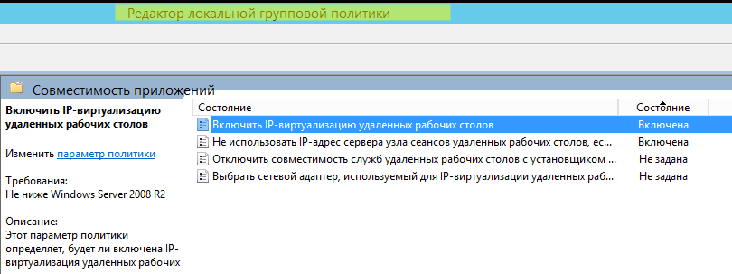

# Пользователи терминального сервера

Терминальный сервер служит для удаленной работы пользователей с
предоставлением каждому пользователю отдельного рабочего стола.
Как правило, терминальный сервер предоставляет сервис для работы
десятков или даже сотен пользователей.

# Авторизация терминального сервера

Если у администратора нет необходимости отдельной авторизации
пользователей терминального сервера и к ним могут быть
применены одинаковые настройки доступа (контент-фильтра и
пользовательского файрвола), то можно авторизовать сервер, как
одного пользователя.

Лучший вариант для этого - [авторизация по IP-адресу](./Авторизация_по_IP-адресу.md).

Обратите внимание, что при большом количестве пользователей на сервере
терминалов, может потребоваться увеличить количество одновременных
сессий с одного адреса в дополнительных параметрах
безопасности.

# Авторизация пользователей терминального сервера

Возможна **раздельная авторизация пользователей** терминального сервера
(работающего под управлением ОС Windows Server 2008 R2 и Windows Server
2012) с помощью авторизации через [Ideco Agent](./Авторизация_через_Ideco_Agent.md) или по [SSO (NTLM)](./Single_Sign-On_аутентификация_через_Active_Directory.md). При этом
сам сервер по IP авторизовать не нужно.

Для раздельной авторизации пользователей терминального сервера на
сервере терминалов нужно настроить **Remote Desktop IP
Virtualization**, а на сервере Ideco UTM настроить авторизацию
пользователей через [Ideco Agent](./Авторизация_через_Ideco_Agent.md)
или [Веб-авторизацию (SSO или NTLM)](./Авторизация_пользователей.md). Авторизация пользователей
терминального сервера по логам контроллера домена AD пока не
реализована.

### Настройка Remote Desktop IP Virtualization на Windows Server 2012

Для работы функции [Remote Desktop IP
Virtualization](https://cloudblogs.microsoft.com/enterprisemobility/2009/07/10/configuring-remote-desktop-ip-virtualization-part-1/)
на одном из Windows-серверов должна быть добавлена роль DHCP-сервера (с
другими DHCP-серверами данная функция может работать некорректно) и
выделена область IP-адресов для пользователей терминального сервера.

**Установка службы:**

Путь: Редактор локальной групповой политики – Конфигурация компьютера –
Административные шаблоны – Служба удаленных рабочих столов – Узел
сеансов удаленных рабочих столов – **Совместимость приложений**:  
включить опцию «Включить IP-виртуализацию удаленных рабочих столов» в
групповой политике с параметром «Для сеансов»:

  

Рекомендуется включить опцию «Не использовать IP-адрес сервера узла
сеансов удаленных рабочих столов, если виртуальный IP-адрес
недоступен».  
Проверить, что настройки изменились, можно командой в PowerShell:

    Get-WmiObject -Namespace root\cimv2\TerminalServices -query "select * from Win32_TSVirtualIP" 

где значения должны быть: VirtualIPActive = 1 (вкл.виртуализация) и
VirtualIPMode=0 (для сессии).

Воспользуйтесь [альтернативным](http://social.technet.microsoft.com/wiki/ru-ru/contents/articles/22770.windows-server-2012-r2-ip.aspx)
вариантом установки, если описанный выше вариант не подходит.

## Attachments:

[rd\_ip.png](attachments/4981069/4981131.png) (image/png)  

