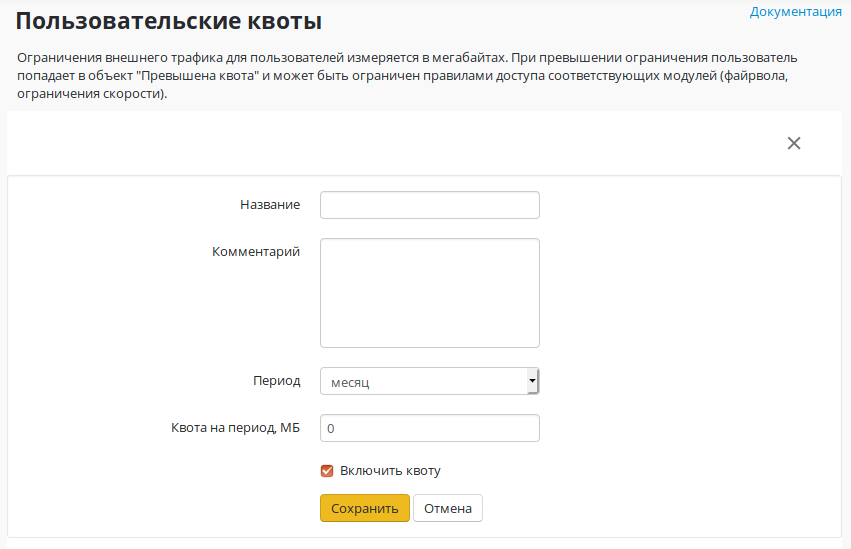
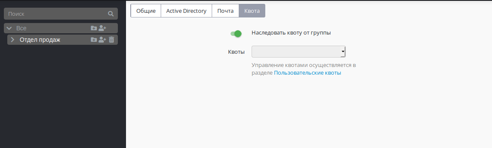
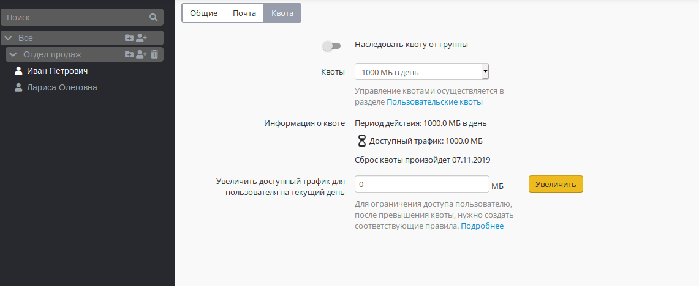
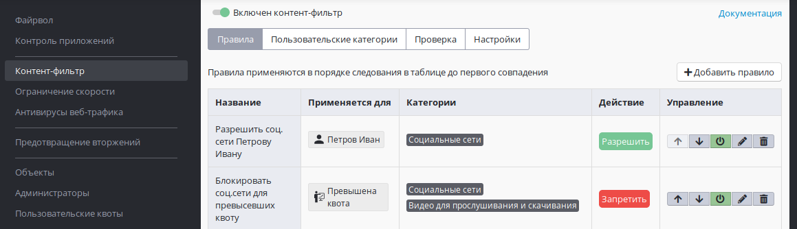
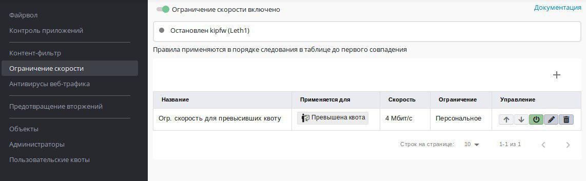

# Пользовательские квоты

В Ideco UTM есть возможность использовать лимиты трафика для
пользователей. **При его превышении пользователь попадает в
объект "Превышена квота" и может быть ограничен правилами доступа
соответствующих модулей (файрвола, ограничения скорости,
контент-фильтра, контроля приложений)**. Для каждой квоты можно
определить ее период действия (день, неделя, месяц, квартал). Она может
быть назначена на пользователей или группы в дереве пользователей, на
отдельной вкладке "Квота", так же на этой вкладке можно увеличить и
посмотреть доступный трафик на текущий период времени и узнать когда
произойдет сброс квоты. Если квота назначена на группу, то все
пользователи из этой группы могут ее унаследовать.

# Настройка квоты

Для создания квоты нужно перейти в раздел **Правила доступа -\>
Пользовательские квоты** и нажать на кнопку "**+**".Заполнить
необходимые поля и нажать кнопку "Сохранить". После создания квоты её
можно отредактировать или удалить.

 

Придумайте название для квоты, выберете период действия на который будет
выделена квота (день, неделя, месяц, квартал), а так же задайте
количество мегабайт трафика, выделенного на выбранный период.  
По умолчанию, все создаваемые квоты будут иметь активное свойство
"Включить квоту". Это свойство позволяет включить или отключить
любую квоту. Отключение квоты приведет к тому что квота станет
безлимитной (ограничений про трафику не будет).

При превышении квоты пользователи попадают в объект "Превышена квота" и
могут быть ограничены правилами доступа файрвола, контент-фильтра,
контроля приложений и ограничения скорости.

 

# Настройка пользователя и группы

## Настройка группы

Созданные квоты можно применить для групп пользователей. Управление
квотами происходит на вкладке "Квота".

  

Вы можете наследовать квоту от вышестоящей группы, или выбрать другую
квоту, для этого потребуется дезактивировать переключатель
"Наследовать квоту от группы" и выбрать нужную вам квоту.

У группы "Все" есть отдельный переключатель "Не использовать квоты".

## Настройка пользователей

Созданные квоты можно применять для пользователей. Управление квотами
происходит на вкладке "Квота".

На этой вкладке вы можете настроить наследование квоты у группы в
которой состоит пользователь или назначить ему персональную
квоту.

Если квота назначена на пользователя, то можно посмотреть информацию о
ней, а именно: период действия, доступный трафик и дату сброса квоты.
Здесь же можно её увеличить, указав нужное количество мегабайт и нажав
на кнопку "Увеличить".

## Пример ограничения доступа для пользователей которые попали в объект "Превышена квота"

В приведённом ниже примере будет рассмотрен случай, когда всем
пользователям превысившим квоту (попавшим в объект "Превышена
квота") будет запрещен доступ ко всем социальным сетям и
видеохостингам, но одному пользователю будет разрешен
доступ в социальные сети (даже если он превысил квоту), так как
этот сотрудник является маркетологом. Так же всем сотрудникам
превысившим квоту будет ограничена скорость до 4 Мбит/с.

1). Создаём квоту 2000 МБ в день.  
2). Назначаем эту квоту на группу "Все".  
3). Во всех группах и в у всех пользователей на вкладке "Квота"
поставить переключатель "Наследовать квоту от группы" в
положение включен. Это нужно сделать только в том случае если
его положение менялось вами, так как по умолчанию все группу и
пользователи создаются с включенным переключателем.  
4). На группу "Все" назначить созданную квоту. (все остальные группы и
пользователи унаследую назначение этой квоты)  
5). Создать правило в контент-фильтре для ограничения доступа с
социальным сетям и видеохостингам для пользователей превысивших
квоту.  
6). Создать правило которое разрешает одному из пользователей социальные
сети, даже если он превысил квоту.

7). Создать правило ограничивающее скорость всем пользователям кто попал
в объект "Превышена квота" до 4 Мбит/с.

## Attachments:

 [image2017-11-1
13:34:33.png](attachments/4981951/5472480.png) (image/png)  
 [image2017-11-1
14:57:53.png](attachments/4981951/5472485.png) (image/png)  
 [image2017-11-1
15:14:33.png](attachments/4981951/5472489.png) (image/png)  
 [image2017-12-20
8:32:34.png](attachments/4981951/5832795.png) (image/png)  
 [image2017-12-20
8:33:17.png](attachments/4981951/5832796.png) (image/png)  

[квота-профиль.PNG](attachments/4981951/6357105.png)
(image/png)  

[квота-баланс.PNG](attachments/4981951/6357106.png)
(image/png)  

[3\_quota\_user\_setting.png](attachments/4981951/6586783.png)
(image/png)  

[4\_quota\_user\_display.png](attachments/4981951/6586785.png)
(image/png)  

[arrow\_right\_alt-24px.svg](attachments/4981951/11239522.svg)
(image/svg+xml)  

[arrow.svg](attachments/4981951/11239530.svg) (image/svg+xml)  

[baseline\_arrow\_right\_alt\_black\_18dp.png](attachments/4981951/11239524.png)
(image/png)  

[Vector.png](attachments/4981951/11239525.png) (image/png)  
 [Group
1.png](attachments/4981951/11239526.png) (image/png)  

[Выделение\_364.png](attachments/4981951/11239527.png)
(image/png)  
 [Plus
button.png](attachments/4981951/11239528.png) (image/png)  
 [Создание
квоты.png](attachments/4981951/11239529.png) (image/png)  

[arrow.svg](attachments/4981951/11239523.svg) (image/svg+xml)  

[Выделение\_368.png](attachments/4981951/11239555.png)
(image/png)  

[Выделение\_369.png](attachments/4981951/11239556.png)
(image/png)  
 [блочим соц
сети.png](attachments/4981951/11436101.png) (image/png)  
 [огр
скорости.jpg](attachments/4981951/11436102.jpg) (image/jpeg)  

