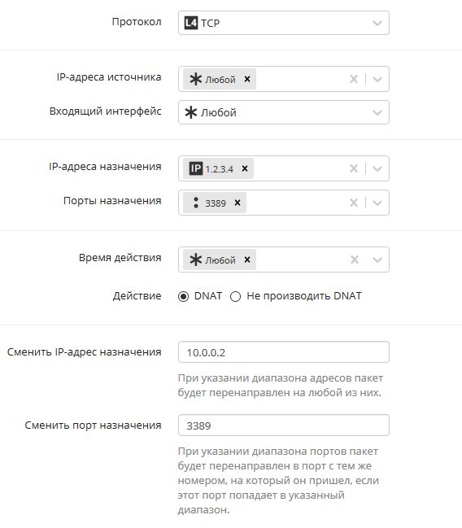
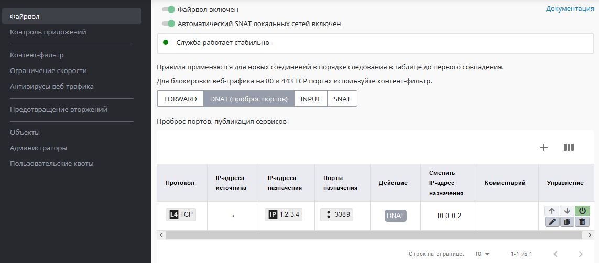

# Портмаппинг (проброс портов, DNAT)

Часто нужно настроить сервер таким образом, чтобы он предоставлял
возможность доступа к сетевой службе, работающей на сетевом
устройстве в локальной сети с приватным ("серым") IP-адресом. Это
называется публикацией сервиса (или сетевой службы) в сети Интернет.
Публикация службы, доступной в локальной сети на устройстве, имеющем
приватный IP-адрес, для возможности доступа к ней из внешних сетей,
работает путем трансляции ("проброса") любого неиспользуемого на
внешнем ("публичном") IP-адресе сервера Ideco UTM сетевого порта на
порт соответствующего сервиса, работающего на сетевом устройстве в
локальной сети. При этом все обращения из внешних сетей на
публичный адрес сервера Ideco по транслируемому порту будут
перенаправлены на публикуемый порт службы, работающей на сетевом
устройстве в локальной сети. Также эта технология называется DNAT,
portmapper, port forwarding. Техническая реализация заключается в
создании правила в таблице DNAT [файрвола](./Файрвол.md) Ideco UTM с
указанием адресов сервера и публикуемой машины и сетевого порта, с
которого и на который будет осуществляться трансляция сетевых
запросов извне.

**Не рекомендуется** использовать проброс портов для публикации **веб и
почтовых серверов (80, 443, 25 порты)**. Для их публикации
воспользуйтесь, пожалуйста, [обратным прокси-сервером](./Обратный_прокси.md) и [почтовым релеем](./Настройка_почтового_релея_для_публикации_сервера_в_локальной_сети.md).
Так ваши сервера будут лучше защищены от атак из сети Интернет.

## Создание правила DNAT в файрволе Ideco UTM

Рассмотрим конкретный пример. Допустим, что публичный адрес сервера
Ideco : 1.2.3.4. Публикуемая служба: RDP (Remote Desktop), работающая по
3389 TCP порту. Адрес компьютера в локальной сети, на котором запущена
служба и к которой нужно получить доступ извне: 10.0.0.2. Теперь,
чтобы настроить трансляцию запросов к этой службе извне через
сервер Ideco на устройство в локальной сети, нужно сделать
следующее:

1.  Настроить авторизацию для сетевого устройства в локальной сети.
    **Сетевое устройство должно быть авторизовано** на Ideco UTM
    (т.е. присутствовать в разделе "Мониторинг" -\> "Авторизованные
    пользователи") и иметь доступ к сети Интернет через Ideco UTM,
    т.е. на устройстве **шлюзом по умолчанию должен быть IP-адрес
    локального интерфейса Ideco UTM**. В противном случае ответы на
    запросы из сети Интернет устройство будет отправлять не на Ideco
    UTM, а значит подключение к устройству установить не получится. Как
    правило, для публикуемых устройств используется авторизация по IP с
    заданным IP-адресом на сетевом устройстве.
2.  Создать правило трансляции портов (DNAT) в разделе ***Правила***
    ***-\> Файрвол - DNAT (проброс портов)*** административного
    веб-интерфейса сервера.  
    Исходя из первоначальной задачи, правило будет выглядеть так:  
      
    Итоговый вид правила в таблице:  
      
      
3.  Готово. Настройки файрвола применяться сразу при создании правила.

Аналогичным образом можно пробросить диапазон портов. Для этого в порте
назначения укажите нужный диапазон, предварительно создав
соответствующий "объект", например 10000-20000, а в поле
"Переадресовать на" укажите диапазон портов 10000-20000.

### Частые ошибки:

  - На устройстве шлюзом по умолчанию прописан не Ideco UTM. В этом
    случае ответы на запросы из сети Интернет устройство будет
    отправлять не на Ideco UTM, а значит установить подключение к
    устройству из сети Интернет не получится. Нужно либо указать
    шлюзом по умолчанию IP-адрес локального интерфейса Ideco UTM.
    Либо если подключение происходит с какого-то определённого
    IP-адреса (сети), то на устройстве прописать маршрут, чтобы
    ответы для этого IP-адреса (сети) направлялись не через шлюз по
    умолчанию, а через IP-адрес локального интерфейса Ideco UTM.
  - **Включен режим "Разрешить интернет всем". При включении этого
    режима, правила файрвола, включая таблицу DNAT, не работают.**

 

  - Проверять работу правила DNAT надо из Интернет, а не из локальной
    сети (из локальной сети оно работать не будет из-за "треугольной
    маршрутизации"). Используйте [обратный прокси-сервер](./Обратный_прокси.md) для
    публикации веб-ресурсов, если вам необходим доступ и из
    локальной сети.
  - Порт на внешнем интерфейсе сервера, с которого будут транслироваться
    запросы, может отличаться от публикуемого порта самой службы.
    Например, можно транслировать внешние запросы на порт 4489 в
    локальную сеть на порт 3389, чтобы воспрепятствовать автоматическим
    попыткам подключения вредоносного ПО на популярный сервис.
  - Также, в целях защиты от нежелательных подключений к публикуемой
    службе, рекомендуется указывать IP-адрес или подсеть, с которой
    разрешено подключаться к публикуемой службе в поле **Источник**
    создаваемого правила. Если разрешается подключение с
    определенного IP-адреса в интернете, то указывается
    IP-адрес хоста с полной маской (34.56.78.81/32), если разрешается
    доступ для подсети, то указывается адрес сети с маской подсети
    (34.56.78.80/28). Если осуществляется трансляция с порта 3389 на
    порт 3389 локального сервера (один и тот же порт), то можно не
    указывать 3389 в поле "Порт:" рядом с полем "Переадресовать на
    адрес:", а оставить там 0 или пустое значение. Система
    автоматически переадресует запрос на соответствующий порт
    устройства в локальной сети.

## Устранение неполадок:

  - Сетевое устройство в локальной сети, на которое делается трансляция
    запросов, должно быть авторизовано на сервере и иметь доступ к сети
    Интернет. Убедитесь, что от клиента есть ping на внешние ресурсы.
    Кроме того основным шлюзом на данном устройстве должен быть
    локальный IP-адрес Ideco UTM (либо прописан соответствующий
    маршрут).
  - Необходимо учитывать, что публикуемая служба должна отвечать клиенту
    во внешней сети через тот же внешний интерфейс сервера, с которого
    пришел изначально запрос. Если в созданном правиле в поле
    ***Назначение*** указан публичный IP-адрес сервера для приема
    подключений извне, если вы переопределили автоматические правила
    NAT-а создав правила в таблице SNAT, настройте правильных адрес SNAT
    для опубликованного сервиса.
  - Брэндмауэр Windows или другие программы защиты часто блокируют
    соединения к системе с внешних адресов в интернете. В таких
    случаях правило на сервере работает и трафик перенаправляется на
    сервер в локальной сети, но он отвергает подключение, что для
    клиента, подключающегося извне, выглядит как отказ в
    соединении или отсутствие связи с сервером, и может
    показаться, что правило трансляции запросов на сервере не
    работает. Для диагностики отключите все брандмауэры, файрволы и
    антивирусы на целевом устройстве.
  - Правило портмаппинга будет осуществлять проброс трафика извне на
    хост в локальной сети. Трафик запроса ресурса из этой же
    локальной сети при обращении на внешний адрес не будет
    проброшен правильно. Будет иметь место асимметричная
    маршрутизация. При диагностике сетевыми утилитами
    подключайтесь из внешних для UTM сетей. Внутри локальной
    сети обращайтесь к сервису по его IP-адресу в локальной сети.
    Альтернативно можно вынести ресурс в отдельную локальную сеть,
    DMZ, и избежать асимметричной маршрутизации, после чего обращаться к
    ресурсу из локальной сети клиентов по внешнему IP-адресу. Пример
    настройки портмаппинга с использованием DMZ-сети для ресурса
    описан выше.
  - **Правила портмапинга не работают в режиме "Разрешить Интернет
    всем"**.
  - В локальной консоли сервера вы можете посмотреть все созданные в
    цепочках iptables правила выполнив команду `iptables -vnL -t nat
    | grep DNAT.` Если правило присутствует и в счетчиках пришедших
    пакетов их больше 0, значит оно правильным образом
    обрабатывается сервером и проблема скорее всего на
    стороне переадресации (например сервер не отвечает на этом
    порту или отправляет ответные пакеты по другому адресу).
  - Трафик проброшенных портов проверяется модулем [предотвращения вторжений](./Предотвращение_вторжений.md), проверьте логи системы в
    случае не работоспособности правила и при необходимости добавьте в
    исключения сработавшее правило.
  - Если необходимо сделать проброс порта с не основного внешнего
    интерфейса, **отключите опцию "Проверка обратного пути
    (RP\_FILTER)"** на вкладке "Сервисы" - "Дополнительно".

## Attachments:

[portmaping.PNG](attachments/1278141/4981223.png) (image/png)  

[dnat\_02\_ng.png](attachments/1278141/4981711.png) (image/png)  

[dnat\_03\_ng.png](attachments/1278141/4981713.png) (image/png)  

[3389.JPG](attachments/1278141/11239545.jpg) (image/jpeg)  
 [dnat
таблица.JPG](attachments/1278141/11239549.jpg) (image/jpeg)  
 [dnat
таблица.JPG](attachments/1278141/11239548.jpg) (image/jpeg)  

