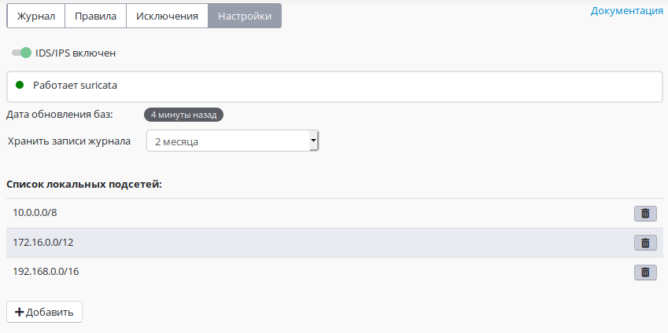
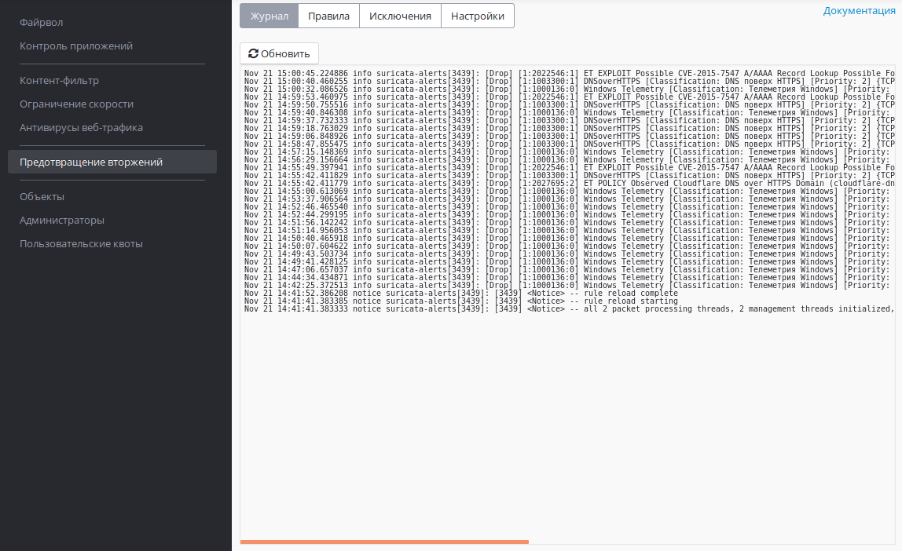
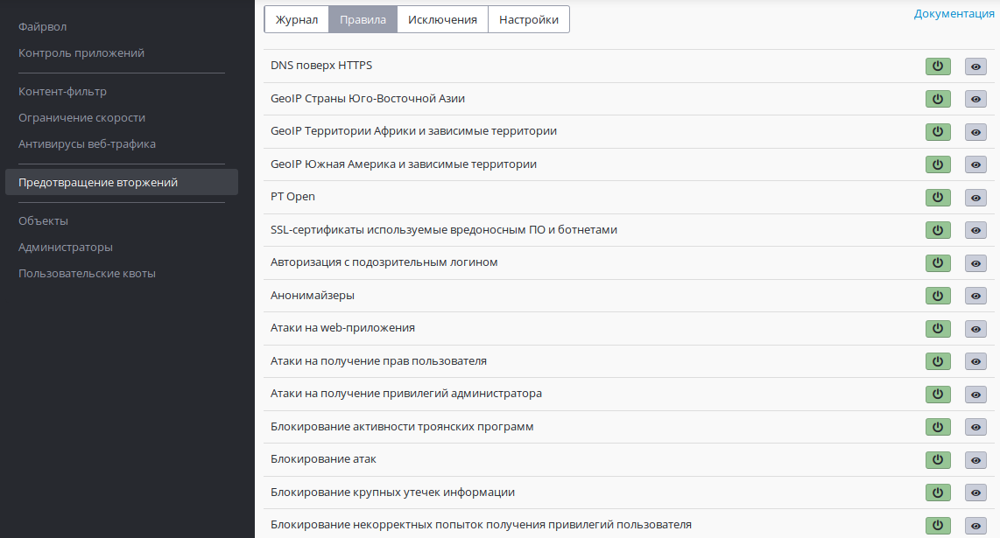
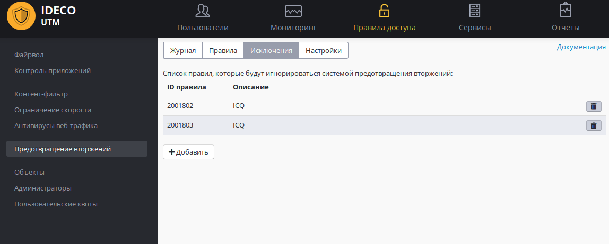

# Предотвращение вторжений

  - [Система обнаружения и предотвращения
    вторжений](#id-Предотвращениевторжений-Системаобнаруженияипредотвращениявторжений)
  - [Журнал](#id-Предотвращениевторжений-Журнал)
  - [Правила](#id-Предотвращениевторжений-Правила)
  - [Исключения](#id-Предотвращениевторжений-Исключения)
  - [Пример анализа
    логов](#id-Предотвращениевторжений-Примеранализалогов)
      - [Пример 1](#id-Предотвращениевторжений-Пример1)
      - [Пример 2](#id-Предотвращениевторжений-Пример2)
  - [Технические
    требования](#id-Предотвращениевторжений-Техническиетребования)

## Система обнаружения и предотвращения вторжений

Система предотвращения вторжений доступна только в активированной
Enterprise версии Ideco UTM для пользователей с активной
[подпиской](https://ideco.ru/buy/ics#subscribe) на обновления.

**Система предотвращения вторжений** (IDS/IPS, Intrusion detection
system / Intrusion prevention system) предназначена для обнаружения,
журналирования и предотвращения атак злоумышленников на сервер,
интегрированные службы (почта, веб-сайт и др.) и защищаемую
интернет-шлюзом локальную сеть.

Правила блокировки трафика включают в себя блокирование активности
троянских программ, spyware, бот-сетей, клиентов p2p и
**торрент**-трекеров, вирусов, сети **TOR** (используемой для
обхода правил фильтрации), анонимайзеров и многое другое.

Настроить службу можно на вкладке **Правила доступа - Предотвращение
вторжений**:

Установив или сняв галочку "**Включить IDS/IPS**" можно соответственно
включить/выключить службу предотвращения вторжений.

В поле "**Список локальных подсетей**" добавьте локальные сети,
обслуживаемые UTM. Как правило, это сети локальных интерфейсов
UTM, а также могут быть маршрутизируемые на них сети удаленных сегментов
локальной сети вашего предприятия. **Ни в коем случае не указывайте
сети, принадлежащие внешним сетевым интерфейсам UTM и внешним
сетям.** Указанные здесь сети участвуют в правилах службы
предотвращения вторжения как локальные, характеризуя трафик
в/из локальных сетей. Локальный межсегментный трафик не исключается из
проверок системы.

Опция "**Хранить записи журнала**" позволяет выбрать время хранения
логов системы: 1, 2 или 3 месяца.

При использовании системы предотвращения вторжений не рекомендуется
использовать внутренние DNS-серверы для компьютеров сети, т.к.
система анализирует проходящие через нее DNS-запросы и определяет
по ним зараженные устройства. В случае использования внутреннего
домена AD, рекомендуется на компьютерах указывать DNS-сервер Ideco
UTM в качестве единственного DNS-сервера, а в настройках
[DNS-сервера](./DNS.md) на UTM указать Forward-зону для локального
домена.

## Журнал

В журнале можно просмотреть последние 100 строк логов предупреждений
системы предотвращения вторжений.

Полные логи системы находятся на сервере в каталоге: `/var/log/suricata`

`drop.log` - информация об отклоненных пакетах.

`fast.log` - логи предупреждений.

`suricata.log` - логи работы службы.

В логах предупреждений указывается группа (Classification), к которой
принадлежит сработавшее правило, ID правила и дополнительная
информация.

## Правила

На вкладке **Правила** доступны для просмотра и включения/отключения
группы правил системы предотвращения вторжений.

При включении/отключении группы правил настройки применяются мгновенно,
без необходимости перезапускать службу.

## Исключения

Есть возможность отключить определенные правила системы предотвращения
вторжений, в случае их ложных срабатываний или по другим причинам.

На вкладке "Исключения" можно добавить ID правила (его номер, см. пример
анализа логов ниже).

Внимание\! Со временем при обновлении баз ID правил могут меняться.

## Пример анализа логов

##### Пример 1

Предупреждение системы предотвращения вторжений:

`04/04/2017-19:31:14.341627 [Drop] [**] [1:2008581:3] ET P2P BitTorrent
DHT ping request [**] [Classification: Запросы на скомпрометированные
ресурсы] [Priority: 1] {UDP} 10.130.0.11:20417 -> 88.81.59.137:61024`

Расшифровка полей:

`04/04/2017-19:31:14.341627` - дата и время события.

`[Drop]`- действие системы, Drop - пакет блокирован, любая другая
информация в этом поле означает Alert, информирование.

`[1:2008581:3`\] - ID правила в группе (ID содержится между знаками
":"). В случае, если правило необходимо добавить в исключения, нужно
добавить туда номер `2008581`.

`[Classification: Запросы на скомпрометированные ресурсы` - трафик
категоризирован правилами группы "Запросы на скомпрометированные
ресурсы"

Таким образом, на вкладке "Правила" можно открыть найденную группу и в
ней найти сработавшее правило по его ID:

    drop udp $HOME_NET any -> $EXTERNAL_NET any (msg:"ET P2P BitTorrent DHT ping request"; content:"d1|3a|ad2|3a|id20|3a|"; depth:12; nocase; threshold: type both, count 1, seconds 300, track by_src;
    reference:url,wiki.theory.org/BitTorrentDraftDHTProtocol; reference:url,doc.emergingthreats.net/bin/view/Main/2008581; classtype:policy-violation; sid:2008581; rev:3;)

По ссылке (после url, в данном примере:
doc.emergingthreats.net/bin/view/Main/2001891), как правило, можно
получить дополнительную информацию о сработавшем правиле.

`10.130.0.11:20417 -> 88.81.59.137:61024` - IP-адрес с которого (в
локальной сети), на который была попытка соединения.

Можно проанализировать IP-адрес, с которым была попытка подозрительного
соединения, через [whois](https://www.nic.ru/whois/).

##### Пример 2

Предупреждение системы предотвращения вторжений:

`07/03/2015-14:52:07.654757  [Drop] [**] [1:2403302:1942] ET CINS Active
Threat Intelligence Poor Reputation IP group 3 [**] [Classification:
Misc Attack] [Priority: 2] {UDP} 24.43.1.206:10980
-> 192.168.10.14:32346`

Для более подробного анализа логов с IP компьютера 192.168.10.14 в
[консоли](./Удаленный_доступ_для_управления_сервером.md) сервера
выполняем команду:

`grep "10.80.1.13:" /var/log/suricata/fast.log`

Получаем достаточно большое количество строк с блокировками соединений с
IP-адресами, классифицируемыми разными категориями опасности.

В результате анализа ПО на компьютере была обнаружена и удалена
adware-программа, на которую не реагировал локально установленный
антивирус.

## Технические требования

Для работы системы предотвращения вторжений требуются значительные
вычислительные ресурсы. Предпочтительным являются многоядерные (4
и более ядер) процессоры. Минимальное количество оперативной памяти для
использования системы: 8 Гб.

После включения системы желательно проконтролировать, что мощности
вашего процессора достаточно для проверки следующего через шлюз
трафика.

В разделе **Мониторинг - Графики загруженности**. Параметр **средняя
загрузка** (за 1, 5 и 15 минут) не должен быть больше, чем
количество физических ядер установленного процессора.

## Attachments:

[Exceptions.PNG](attachments/4325506/4982722.png) (image/png)  

[Правила.JPG](attachments/4325506/4983005.jpg) (image/jpeg)  

[Настройки.JPG](attachments/4325506/4983006.jpg) (image/jpeg)  

[Журнал.JPG](attachments/4325506/4983009.jpg) (image/jpeg)  

[ips.JPG](attachments/4325506/6587102.jpg) (image/jpeg)  

[суриката.png](attachments/4325506/12025878.png) (image/png)  
 [журнал
сурикаты.png](attachments/4325506/12025880.png) (image/png)  
 [правила
сурикаты.png](attachments/4325506/12025882.png) (image/png)  

[исключения.png](attachments/4325506/12025884.png)
(image/png)  

