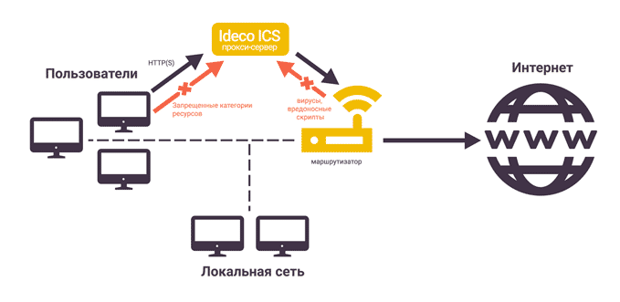

# Прокси

## Прокси-сервер для веб-трафика

Служба прокси в составе Ideco UTM по умолчанию после установки шлюза
настроена для **прозрачного проксирования** веб-трафика потребителям
в локальной сети предприятия, таким образом на хостах локальной сети не
нужно явно указывать настройки прокси. Достаточно указания UTM в
качестве шлюза по умолчанию для устройств в сети.  
Признак **«**Игнорировать ошибки модулей проверки и обработки
веб-трафика (ICAP error)» применяется при наличии в сети
сторонних ICAP-служб (DLP, антивирусы веб-трафика и т.д...) и во
включенном состоянии не разрешает трафик пользователям, если такая
служба возвращает в UTM ошибки.

По умолчанию кэширование трафика на диск отключено, но оно
осуществляется в оперативной памяти сервера. Включить
кэширование веб-трафика на диск вы можете в разделе **«Сервисы ➔
Прокси»**, но мы не рекомендуем этого делать по причине излишней
нагрузки на дисковую подсистему. Как правило, кэширования в
оперативную память достаточно.

**  
Прямые подключения** к прокси-серверу можно настроить, отметив
соответствующий чекбокс в **«Сервисы ➔ Прокси**», указав
IP-адрес и порт на стороне UTM. Затем эти реквизиты следует указать
на тех сетевых устройствах локальной сети, веб-трафик которых нужно
пропускать через прокси.

Настройка фильтрации HTTPS-трафика имеет свои особенности и описана в
инструкции [настройка фильтрации HTTPS](./Настройка_фильтрации_HTTPS.md).  
Ниже предоставлен скриншот вкладки **«Общие»** раздела **«Прокси»**.

## Роль прокси-сервера в работе шлюза Ideco UTM

Прокси-сервер, помимо проксирования веб-трафика, играет роль
мастер-службы для нескольких сервисов, связанных с
обработкой, контролем и учетом веб-трафика пользователей на
шлюзе, а именно:

  - Антивирус для веб-трафика (Антивирус Касперского или ClamAV).
  - Сервис отчетности по веб-трафику пользователей.
  - Контент-фильтр.

## Прямые подключения к прокси-серверу

Данный режим применяется в случае, когда Ideco UTM не является шлюзом по
умолчанию для клиентов сети.

Настройка режима:

  - Указать локальный IP-адрес Ideco UTM в качестве веб-прокси в
    локальной сети на клиентских устройствах. Возможно
    использование прокси-сервера для всех протоколов.
  - В настройках прокси на Ideco UTM должны быть указаны IP-адрес и
    порт для прямых подключений к прокси (возможен выбор портов из
    списка: 3128, 1080, 8000, 8080, 8888, 8081, 8088, 10080).

В таком режиме UTM сможет предоставлять хостам веб-контент и трафик по
другим портам (по-умолчанию по всем, при необходимости можно закрыть
порты [файрволом](./Файрвол.md)), по необходимости производя учет
([квоты](./Пользовательские_квоты.md)), контроль и проверку веб-трафика
на вирусы, контент и вредоносное содержимое при соблюдении следующих
условий:

  - Наличие доступа в Интернет у сервера Ideco UTM (его внешний
    интерфейс должен находится в не пересекающейся с локальной
    подсетью диапазоне и иметь доступ в сеть Интернет).
  - Авторизованности хоста-потребителя веб-трафика на сервере UTM по
    одному из [типов авторизации](./Типы_авторизации.md), поддерживаемом
    UTM.
  - Явном указании хосту (в настройках прокси-сервера в браузерах)
    адреса веб-прокси. При [Single Sign-On](./Single_Sign-On_аутентификация_через_Active_Directory.md)
    авторизации через Active Directory необходимо указывать в настройках
    доменное имя Ideco UTM, а не его IP-адрес.

Если в настройках программы под ОС Windows или Mac OS X нет возможности
указать прокси-сервер, то можно воспользоваться сторонним ПО для
маршрутизации всего трафика рабочей станции на прокси-сервер.  
Например, такую возможность представляет программа
[Proxifier](./Настройка_программы_Proxifier_для_прямых_подключений_к_прокси-серверу.md).

## Исключения ресурсов из обработки прокси-сервером

На вкладке "Исключения" возможно исключить ресурсы из обработки
прокси-сервером и всеми связанными службами (контент-фильтр,
веб-отчетность, антивирусы).

  - По источнику: прокси-сервер исключается из обработки запросов из
    указанных внутренних сетей или IP-адресов.
  - По назначению: прокси-сервер исключается из обработки запросов на
    внешние сети или IP-адреса (как правило адреса веб-сайтов или
    веб-сервисов).

**Исключить трафик из обработки прокси-сервером нельзя для варианта
прямых подключений к прокси-серверу. Исключения нужно делать в
настройках прокси-сервера на устройстве (в веб-браузере или
системных настройках прокси-сервера).  
**

## Attachments:

[schema2.png](attachments/1900622/4982893.png) (image/png)  

[1\_general.png](attachments/1900622/6586797.png) (image/png)  

[1\_general.png](attachments/1900622/6586796.png) (image/png)  
 [прокси
общие.png](attachments/1900622/12025873.png) (image/png)  

