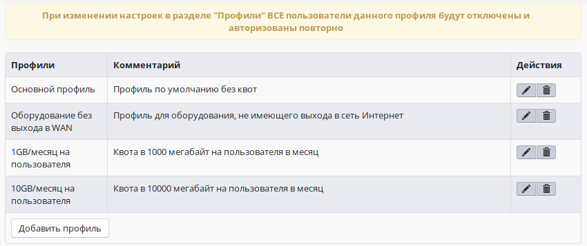
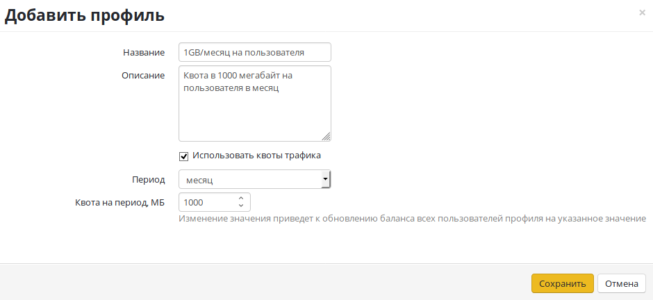

# Профили выхода в Интернет

  - [Профили](#id-ПрофиливыходавИнтернет-Профили)
  - [Создание и редактирование
    профиля](#id-ПрофиливыходавИнтернет-Созданиеиредактированиепрофиля)
  - [Пример использования профиля для лимитирования
    трафика](#id-ПрофиливыходавИнтернет-Примериспользованияпрофилядлялимитированиятрафика)

# Профили

**Профили** используются для настройки квот трафика для пользователей.  
Ниже предоставлен пример списка профилей с двумя созданными записями:
1GB/месяц на пользователя и 10GB/месяц на пользователя.

# Создание и редактирование профиля

Для создания нового профиля нажмите «**Создать профиль»**. Для
редактирования существующего профиля
выберите «**Редактировать» **в «**Действиях»**.

В открывшемся окне укажите:

  - **Название** профиля.
  - **Описание** - для вашего удобства.
  - Установите флажок **"Использовать квоты трафика"**, если это
    необходимо.
  - **Период**, на который лимитируется трафик.
  - **Квота на период** - количество мегабайт внешнего трафика,
    выделенного на период.

# Пример использования профиля для лимитирования трафика

В Ideco UTM возможна настройка лимитов трафика для пользователей.
Подробнее о настройке рассказывается в разделе
**[Квоты](./Пользовательские_квоты.md)**.

 

## Attachments:

[профиль.PNG](attachments/1704070/6357111.png) (image/png)  

[профиль2.PNG](attachments/1704070/6357114.png) (image/png)  

[1\_profiles\_list.png](attachments/1704070/6586778.png) (image/png)  

[2\_create\_profile\_record.png](attachments/1704070/6586780.png)
(image/png)  

