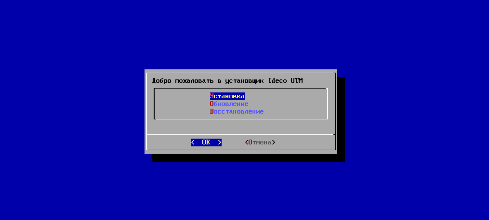
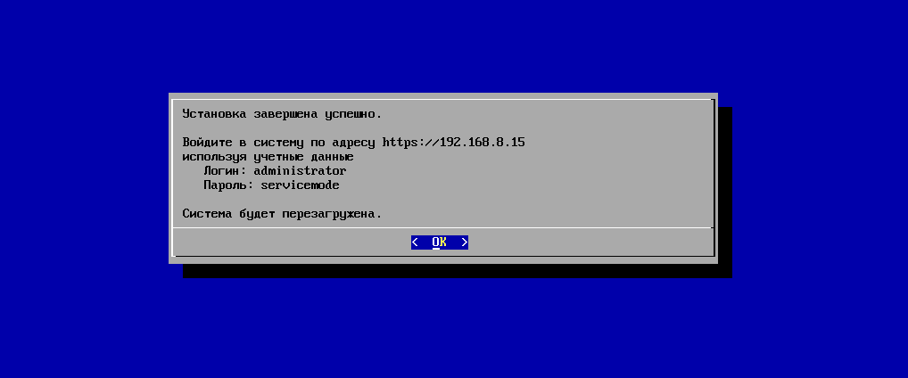

# Процесс установки

### Этап 1. Режим установки

Теперь настало время перейти непосредственно к установке интернет-шлюза.
Установщик Ideco UTM выводит краткую справку, включающую в себя
информацию о командах:

  - memtest – проверка оперативной памяти компьютера;
  - setup – запуск процесса установки Ideco UTM.

В нижней части экрана вы можете обнаружить строку с приглашением для
ввода команды, она начинается со слова boot. С помощью этой строки
вы можете отдавать загрузчику команды. Загрузчик передаст управление
установщику Ideco UTM, описанному в этом подразделе. Загрузчик
интернет-шлюза Ideco UTM проиллюстрирован в подразделе
"[Подготовка к установке](./Подготовка_к_установке.md)". 

Если необходимо проверить работоспособность оперативной памяти,
например, когда сервер периодически зависает по непонятным
причинам, введите команду ***memtest***. Произойдет запуск
специальной программы тестирования, которую мы рекомендуем
оставить запущенной на 3-4 часа.

Приступим к установке интернет-шлюза. Для этого достаточно нажать
клавишу "***Enter***".

###  Этап 2. Начало установки

В первую очередь необходимо определиться с типом установки. Возможные
варианты:

  - **Установка** – первоначальная установка, подходит для большинства
    пользователей.

  - **Обновление** – предназначена для обновления более старых версий
    шлюза безопасности (этот пункт может отсутствовать в некоторых
    версиях Ideco UTM).

  - **Восстановление** – предназначен для восстановления
    работоспособности и требуется в случаях
    возникновения сбоя, который привел к
    неработоспособности интернет-шлюза.
    
    

    
    

    
    Пользовательские настройки при восстановлении и обновлении шлюза
    сохраняются.
    
    

    
    

Выберем пункт ***"Установка"*** и нажмем кнопку ***"OK"***. Меню выбора
типа установки показано показано на снимке экрана ниже:

 

Система предупреждает о том, что при установке будут уничтожены все
данные, которые хранятся на жестком диске. Предупреждение об
уничтожении данных изображено на следующем снимке экрана.
Рекомендуем вам убедиться в том, что диск не содержит важной
информации, так как её восстановление будет невозможно. Для
продолжения нажмите кнопку "Да".

Внимательно прочтите лицензионное соглашение с конечным пользователем на
использование программного продукта. Нажатие кнопки "***Согласен***"
будет свидетельствовать о том, что вы согласны со всеми его
положениями. Лицензионное соглашение представлено на следующем
снимке экрана.

  

 

Далее необходимо выбрать часовой пояс, дату и указать время. Убедившись,
что все настройки верны, нажмите кнопку ***"Продолжить"***.

 

  

 

Теперь система предложит вам настроить локальный сетевой интерфейс.
Локальным считается интерфейс, к которому будет подключена
локальная сеть вашего предприятия. Для настройки локального
интерфейса вам потребуется выбрать сетевой адаптер, к которому
планируется подключить локальную сеть. Второй свободный адаптер
будет, соответственно, использован для подключения к сети вашего
интернет-провайдера. Меню настройки локального сетевого интерфейса
проиллюстрировано ниже.

 

При определении локального интерфейса вы можете столкнуться со
сложностями идентификации сетевой карты. Иногда у нескольких
адаптеров может быть один и тот же производитель. В этом случае для
правильного выбора необходимо будет идентифицировать устройство по
его MAC-адресу. Не бойтесь ошибиться, в дальнейшем вы сможете
изменить эти настройки.

Когда локальный интерфейс определен, необходимо его настроить. Назначьте
IP-адрес и маску сети, используемые для адресации в локальной сети
предприятия. Именно по этим сетевым реквизитам будут доступны
службы Ideco UTM, такие как почтовый или web-сервер. Процесс
назначения сетевых реквизитов вы можете увидеть на снимке экрана
ниже. После завершения настройки локального сетевого интерфейса нажмите
кнопку "ОК".

Система произведет необходимые для установки тесты дисковой подсистемы.
Создание таблицы разделов и их форматирование будет осуществлено в
автоматическом режиме. После завершения создания разделов начнется
копирование системных файлов на диск. Этот процесс, отображенный ниже,
обычно занимает 5-15 минут. Копирование проходит в автоматическом
режиме. После его завершения мастер установки автоматически
настроит основные параметры системы в соответствии с
конфигурацией вашего компьютера.

Поздравляем\! Установка успешно завершена. Перед вами информация о
реквизитах доступа к интерфейсу администратора Ideco UTM, которая
показана на следующем снимке экрана. По умолчанию в системе
присутствует учётная запись аdministrator со стандартным
паролем. Используйте её для дальнейшего управления интернет-шлюзом.
Запомните или запишите реквизиты доступа и нажмите кнопку "OK".

Обязательно смените стандартный пароль учетной
записи аdministrator сразу после перезагрузки компьютера
на этапе первоначальной настройки (см. раздел "Первоначальная
настройка").

Также обязательно установите пароль доступа в локальную консоль сервера,
после его первоначальной загрузки.

Завершающим шагом является перезагрузка компьютера. Нажмите кнопку
"***OK***".

Не забудьте извлечь носитель с дистрибутивом после завершения установки
UTM.

Обязательно задайте пароль входа в локальную консоль сервера при первой
загрузке сервера, иначе это сможет сделать кто-либо другой.

После перезагрузки можно приступать к дальнейшему конфигурированию Ideco
UTM. Этот процесс рассмотрен в разделе "Первоначальная настройка".

## Установка Ideco UTM с USB flash носителя

Ideco UTM можно установить с flash-накопителя, записав установочный
ISO-образ на него. В этой статье описан процесс подготовки
установочного flash-накопителя для установки Ideco UTM с
него.

## Attachments:

[install\_2.png](attachments/1278001/6586852.png) (image/png)  

[install\_3.png](attachments/1278001/6586853.png) (image/png)  

[install\_4.png](attachments/1278001/6586854.png) (image/png)  

[install\_5.png](attachments/1278001/6586855.png) (image/png)  

[install\_6.png](attachments/1278001/6586856.png) (image/png)  

[install\_7.png](attachments/1278001/6586857.png) (image/png)  

[install\_8.png](attachments/1278001/6586858.png) (image/png)  

[install\_9.png](attachments/1278001/6586859.png) (image/png)  

[install\_10.png](attachments/1278001/6586860.png) (image/png)  

[install\_11.png](attachments/1278001/6586861.png) (image/png)  

[install\_12.png](attachments/1278001/6586862.png) (image/png)  

