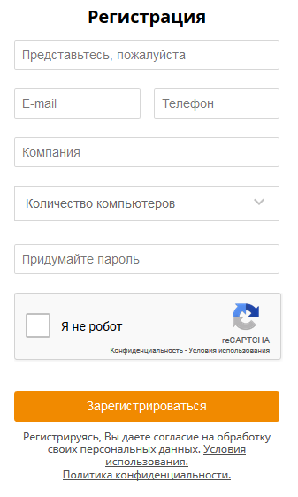
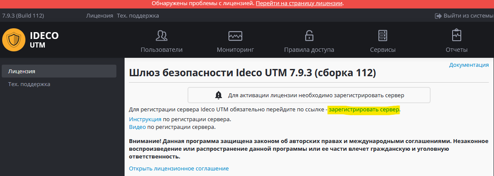
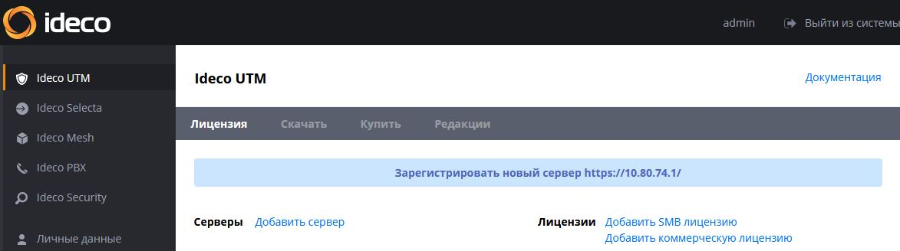
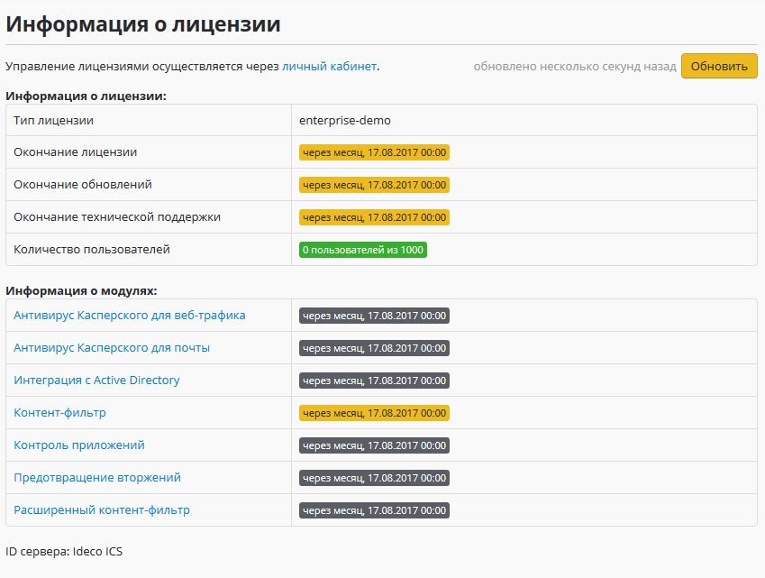
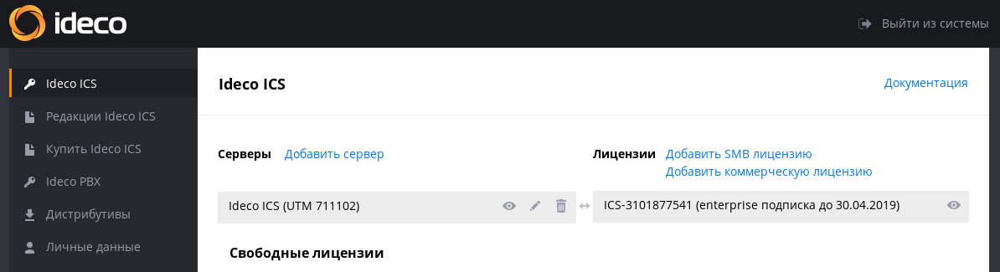
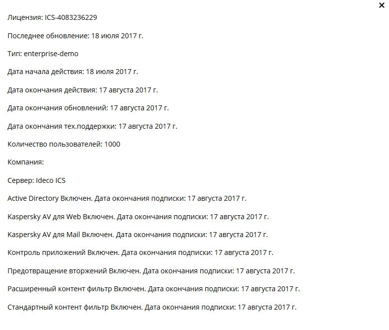

# Регистрация сервера

Для активации лицензии необходима обязательная регистрация сервера в
[личном кабинете](https://my.ideco.ru).

  - [Личный кабинет](#id-Регистрациясервера-Личныйкабинет)
      - [Регистрация в личном
        кабинете](#id-Регистрациясервера-Регистрациявличномкабинете)
      - [Регистрация сервера](#id-Регистрациясервера-Регистрациясервера)
      - [Просмотр информации о
        лицензиях](#id-Регистрациясервера-Просмотринформацииолицензиях)
      - [Управление
        лицензиями](#id-Регистрациясервера-Управлениелицензиями)
      - [Добавление коммерческой
        лицензии](#id-Регистрациясервера-Добавлениекоммерческойлицензии)

# Личный кабинет

Личный кабинет [my.ideco.ru](https://my.ideco.ru) позволяет пользователю
получить информацию о имеющихся лицензиях, сроке окончания [подписки на
обновления](https://ideco.ru/buy/ics#subscribe) модулей и технической
поддержки.

Требуется обязательная регистрация сервера в личном кабинете в том числе
для получения 30-ти дневной пробной лицензии на Ideco UTM (она будет
получена автоматически при регистрации сервера), а также для
активации [коммерческих](https://ideco.ru/buy/ics) и
[бесплатных](https://ideco.ru/products/ics/free-edition)
лицензий.

## Регистрация в личном кабинете

Зайдите на сайт личного кабинета и перейдите по ссылке
"Зарегистрироваться".

Укажите свои личные данные и данные о компании. **Адрес электронной
почты будет использоваться в качестве логина** в личный кабинет и
для восстановления пароля.

Также для регистрации и авторизации вы можете использовать учетные
записи google, mail.ru или яндекса.

## Регистрация сервера

После установки Ideco UTM для полноценной работы сервера необходима его
регистрация.

**Для регистрации сервера на нем должен быть доступен интернет
(обязательно настройте внешний интерфейс и [подключение к провайдеру](./Подключение_к_провайдеру.md)** **перед регистрацией).**

Выполните для этого следующие действия:

1.  **[Зарегистрируйтесь](https://my.ideco.ru/register/)** **в личном
    кабинете** пользователя, если вы не делали этого ранее.
2.  В веб-интерфейсе Ideco UTM перейдите на вкладку "Лицензия" и нажмите
    на ссылку "Зарегистрировать сервер".  
      
      
3.  В открывшемся окне личного кабинета перейдите по ссылке
    "Зарегистрировать новый сервер <https://x.x.x.x/>"
    (зайдите в личный кабинет под своей учетной записью, если это
    не произошло автоматически).  
      
      
      

После регистрации сервер автоматически получит лицензию (если он имеет
доступ к интернету) и в веб-интерфейсе можно будет увидеть ее
состояние:

Привязать к серверу коммерческую лицензию вы можете по инструкции,
расположенной ниже в разделе "управление лицензиями".

## Просмотр информации о лицензиях

В разделе **Ideco UTM** находится информация о зарегистрированных вами
серверах и имеющихся лицензиях. Тестовую 30-ти дневную лицензию на
сервер можно получить автоматически при его регистрации.

Доступны следующие типы лицензий, соответствующие одноименным редакциям
(подробнее о [редакциях Ideco
UTM](https://ideco.ru/products/ics/editions)):

<table>
<thead>
<tr class="header">
<th style="text-align: center;">Название лицензии</th>
<th style="text-align: center;">Редакция</th>
<th style="text-align: left;">Подключенные модули, ограничения</th>
</tr>
</thead>
<tbody>
<tr class="odd">
<td style="text-align: center;">enterprise-demo</td>
<td style="text-align: center;">30-ти дневная пробная версия</td>
<td style="text-align: left;">Авторизация до 1000 пользователей. 
Включены все модули и техническая поддержка на 30 дней. Срок действия лицензии - 30 дней. 
Данную лицензию нельзя переназначить на другой сервер или переместить в свободные. Она выдается один раз при регистрации сервера.</td>
</tr>
<tr class="even">
<td style="text-align: center;">SMB</td>
<td style="text-align: center;">SMB (<a href="https://ideco.ru/products/ics/free-edition">бесплатная редакция</a>)</td>
<td style="text-align: left;">Авторизация до 20 пользователей. 
Модули интеграции с Active Directory, антивирус Касперского для web и почты, антиспам Касперского, контроль приложений (<em>бесплатно первые 9 месяцев</em>), предотвращение вторжений (<em>бесплатно первые 9 месяцев</em>), расширенный контент-фильтр (<em>бесплатно первые 9 месяцев</em>), доступ к технической поддержке приобретаются отдельно и не входят в бесплатную лицензию.</td>
</tr>
<tr class="odd">
<td style="text-align: center;">enterprise</td>
<td style="text-align: center;">Enterprise</td>
<td style="text-align: left;">Количество авторизованных пользователей ограничено лицензией. 
Включены модули интеграции с Active Directory, контроль приложений, предотвращение вторжений, расширенный контент-фильтр, доступ к технической поддержке на период активности <a href="https://ideco.ru/buy/ics#subscribe">подписки</a> на редакцию (кроме модуля интеграции с Active Directory, который доступен всегда во время действия лицензии на Ideco UTM). 
Модули антивируса и антиспама Касперского приобретаются отдельно (для покупки вы можете обратиться в <a href="https://ideco.ru/buy/ics#buy">отдел продаж</a>).</td>
</tr>
</tbody>
</table>

При отсутствии лицензии для сервера Ideco UTM или при окончании срока
действия лицензии, сервер работает в режиме "разрешить интернет
всем", при этом авторизация пользователей и фильтрация трафика не
осуществляется. Коммерческие лицензии и лицензия SMB действуют не
менее 10 лет с момента выписки лицензии и могут быть
[продлены](https://ideco.ru/buy/ics#subscribe).

Выполнить регистрацию сервера, просмотреть информацию о имеющихся
лицензиях и добавить коммерческую лицензию (если она куплена) или
лицензию SMB можно в разделе "Ideco UTM" личного кабинета.

 

Подробный просмотр информации о сервере и лицензии доступен при нажатии
на значок "глаза".

Для удобства вы можете изменить имя сервера, нажав на иконку "карандаша"
рядом с названием сервера.

Подробная информация о лицензии содержит сведения о дате действия
имеющихся модулей, количестве пользователей и сроке окончания
обновлений и технической поддержки продукта.

## Управление лицензиями

Привязка лицензий к серверу осуществляется методом drag-and-drop. Вы
можете назначить имеющиеся коммерческие лицензии на любой
зарегистрированный вами сервер Ideco UTM с учетом следующих
ограничений:

  - Одна лицензия может быть привязана только к одному серверу.
  - Демо-лицензию (enterprise-demo) нельзя привязать к другому серверу.
    Можно только удалить ее, перетащив в "свободные лицензии".
  - Демо-лицензию (enterprise-demo) нельзя повторно получить на одну и
    ту же инсталляцию сервера.

В будущем в личном кабинете появится возможность покупки модулей,
выставления счетов на продление и покупку лицензий. В настоящее
время для осуществления этих операций вы можете обратиться в [отдел
продаж](https://ideco.ru/buy).

## Добавление коммерческой лицензии

После покупки лицензии вы получите токен (текстовый ключ) вида:
"owhYLGvT6Xmt819JyinSxREkJfvjVO63".

Чтобы добавить лицензию в личный кабинет в разделе "Ideco UTM" нажмите
на ссылку "Добавить коммерческую лицензию" и скопируйте в поле
имеющийся токен.

После этого токен будет недействителен, а в свободных лицензиях появится
купленная вами лицензия.

Методом drag-and-drop привяжите лицензию к нужному вам серверу (после
его регистрации в кабинете, см. следующий раздел).

 

 

## Attachments:

[reg.JPG](attachments/4982927/4982932.jpg) (image/jpeg)  

[license2.JPG](attachments/4982927/4982946.jpg) (image/jpeg)  

[token.JPG](attachments/4982927/4982950.jpg) (image/jpeg)  

[reg2.JPG](attachments/4982927/4982951.jpg) (image/jpeg)  

[reg3.JPG](attachments/4982927/4982956.jpg) (image/jpeg)  

[license.png](attachments/4982927/6357122.png) (image/png)  

[reg\_myideco.PNG](attachments/4982927/6586839.png) (image/png)  

[reg2019.png](attachments/4982927/12025909.png) (image/png)  

[reg2019-myideco.JPG](attachments/4982927/12025910.jpg) (image/jpeg)  

