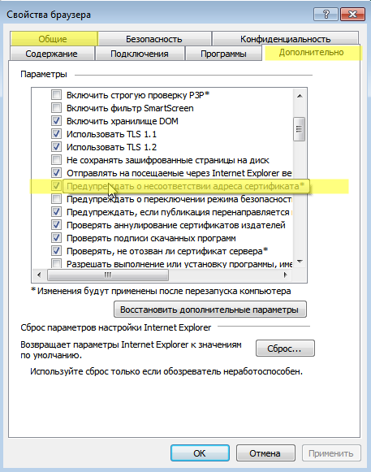
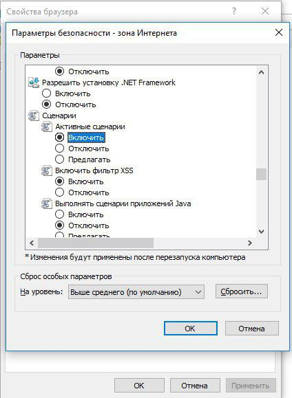

# Скрипты автоматической авторизации/разавторизации

Авторизация и разавторизация пользователей возможна в полностью
автоматическом режиме.

Для этого нужно настроить скрипты, исполняемые при входе пользователей в
систему
([logon](https://technet.microsoft.com/ru-ru/library/cc770908.aspx)) и
выходе пользователей из системы
([logout](https://technet.microsoft.com/ru-ru/library/cc753583.aspx)).
Это можно сделать, например, с помощью групповых политик домена (GPO).

Для работы данных скриптов необходимо выполнить все настройки политик
безопасности домена и браузера, описанные в статье ["Авторизация пользователей Active Directory"](./Авторизация_пользователей.md).

### Авторизация пользователя

Необходимо добавить скрипт в сценарии, выполняемые [при входе в
систему](https://technet.microsoft.com/ru-ru/library/cc770908.aspx).**  
**

**UTMLogon\_script.vbs**

    Dim IE
    Set IE = CreateObject("InternetExplorer.Application")
    IE.Visible = True
    IE.Fullscreen = False
    IE.Toolbar = False
    IE.StatusBar = False
    Wscript.Sleep(3000)
    IE.Navigate2("http://ya.ru")
    Wscript.Sleep(20000)
    IE.Quit

### Деавторизация пользователя

Удобно применять этот скрипт, когда один компьютер используют разные
пользователи для посещения ресурсов сети Интернет.

Для работы разавторизации пользователя необходима [установка сертификата](./Настройка_фильтрации_HTTPS.md) сервера в
качестве доверенного корневого центра сертификации на компьютеры
пользователей. Можно сделать это локально или через групповые
политики домена, как описано в инструкции.

Также необходимо отключить предупреждение о несоответствии адреса
сертификата в свойствах Internet Explorer:

Этот параметр также можно установить через GPO, изменив параметр
реестра:

HKEY\_CURRENT\_USER\\Software\\Microsoft\\Windows\\CurrentVersion\\Internet
Settings\\ параметр WarnonBadCertRecving = 0

Далее необходимо добавить скрипт, выполняемый [при выходе пользователя
из
системы](https://technet.microsoft.com/ru-ru/library/cc753583.aspx):

**UTMLogout\_script.vbs**

    Set objLocator = CreateObject("WbemScripting.SWbemLocator")
    Set objWMIService = objLocator.ConnectServer(".", "root\cimv2")
    
    Set HostNameSet = objWMIService.ExecQuery("Select * From Win32_NetworkAdapterConfiguration WHERE IPEnabled = True")
    Set objHTTP = CreateObject("WinHttp.WinHttpRequest.5.1")
    For Each objitem in HostNameSet
        If NOT IsNULL(objItem.IPAddress)Then
            For Each Ip in objItem.IpAddress
                Url = "https://IP-адрес UTM/monitor_backend/sessions/logout/" & Ip
                objHTTP.Open "DELETE", Url, False
                On Error Resume Next
                objHTTP.send("")
           Next
        End If
    
    Next

(вместо "IP-адрес UTM" - укажите IP-адрес локального интерфейса Ideco
UTM).

### Возможные ошибки выполнения скриптов

  - Если пользователь видит окно Internet Explorer с текстом "Для
    получения доступа требуется аутентификация" и авторизация
    происходит только при ручном переходе по ссылке на авторизацию,
    значит по каким-то причинам не происходит редирект в браузере на
    страницу авторизации (он может быть ограничен настройками
    безопасности браузера).  
    Для обхода этой ошибки вы можете поместить сайт <http://ya.ru> в
    зону "Местная интрасеть", тогда авторизация будет происходить
    прозрачно.  
    Также параметр "Активных сценариев" в Internet Explorer должен быть
    установлен в значение "Включить":  
    
  - Автоматически групповая политика обновляется не сразу после внесения
    изменений. Чтобы скрипты начали работать, обновите политику вручную
    командой gpupdate на рабочей станции.

## Attachments:

[ie11.png](attachments/4981041/4981066.png) (image/png)  

[ie11.png](attachments/4981041/4981065.png) (image/png)  
 [активные
сценарии.jpg](attachments/4981041/6586987.jpg) (image/jpeg)  

