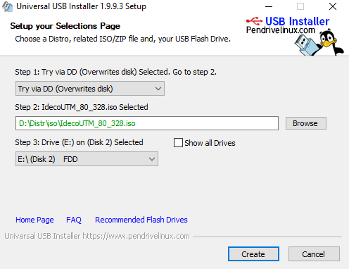

# Создание загрузочного USB flash диска

## Создание загрузочного USB flash диска с Ideco UTM в среде Windows.

Для того чтобы создать загрузочный USB flash диск в Windows и записать
на него установочный образ Ideco UTM в Microsoft Windows, нужно:

В BIOS сервера включить загрузку с flash диска.

 

1.  Скачать утилиту
    [Universal-USB-Installer](http://ideco.ru/assets/Universal-USB-Installer-1.9.9.3.zip).
2.  Создать загрузочный usb flash диск. Примите лицензионное соглашение.
    На следующем шаге выбрать **"Try via DD (Overwrite disk)"** и
    указать путь к ISO образу Ideco UTM как показано на
    иллюстрациях ниже.  
    
3.  В UEFI (BIOS) сервера включить загрузку с flash диска. 
4.  Загрузить сервер с созданного flash диска. Будет запущен мастер
    установки Ideco UTM.  
     

 Далее действуйте согласно инструкции мастера установки. Подробнее шаги
по установке Ideco UTM описаны в разделе документации "Установка".

##  Создание загрузочного USB flash диска с Ideco UTM в среде Linux.

Для создания загрузочного USB flash диска в Linux достаточно поблочно
скопировать ISO-образ Ideco UTM на устройство. Например с помощью
стандартной утилиты Linux - "dd".

## Attachments:

[usbflash-uui-step1-license.png](attachments/1278155/1441944.png)
(image/png)  

[usbflash-uui-step2-create-bootable-drive.png](attachments/1278155/1441945.png)
(image/png)  

[disk1.PNG](attachments/1278155/20250625.png) (image/png)  

