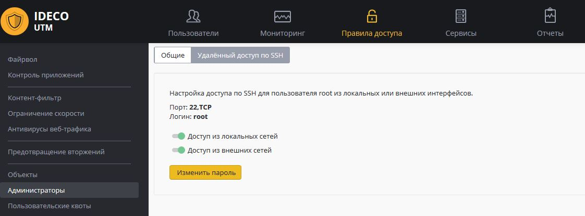

# Удаленный доступ для управления сервером

## Удаленный доступ к локальному меню

Существует несколько способов удаленного доступа к меню сервера:

  - [Удаленный доступ к локальному
    меню](#id-Удаленныйдоступдляуправлениясервером-Удаленныйдоступклокальномуменю)
      - [Подключение из локальной
        сети](#id-Удаленныйдоступдляуправлениясервером-Подключениеизлокальнойсети)
      - [Подключение из
        Интернета](#id-Удаленныйдоступдляуправлениясервером-ПодключениеизИнтернета)
  - [Доступ к веб-интерфейсу управления сервером из сети
    Интернет](#id-Удаленныйдоступдляуправлениясервером-Доступквеб-интерфейсууправлениясерверомизсетиИнтернет)
      - [Публикация веб-интерфейса через обратный
        прокси-сервер](#id-Удаленныйдоступдляуправлениясервером-Публикациявеб-интерфейсачерезобратныйпрокси-сервер)
      - [Подключение по
        VPN](#id-Удаленныйдоступдляуправлениясервером-ПодключениепоVPN)
      - [Используя
        SSH-туннель](#id-Удаленныйдоступдляуправлениясервером-ИспользуяSSH-туннель)

### Подключение из локальной сети

Подключение к локальному меню осуществляется по SSH. Для организации
доступа из локальной сети к меню сервера необходимо выполнить
следующие действия.

1\. Разрешить подключение по SSH. Для этого перейдите в меню
***"*****Сервисы - Дополнительно**" и активируйте пункт ***"Доступ из
локальных сетей"***.  
  
2\. Подключиться к серверу с помощью любого SSH-клиента (например,
PuTTY), используя 22 порт. Необходимо указать логин **root** и пароль
локальной консоли (можно изменить на странице управления удаленным
доступом по SSH, нажав кнопку "Изменить пароль").  
Используйте команду **ideco-local-menu** для запуска меню, команду
**mc** – для запуска файлового менеджера.

### Подключение из Интернета

Для подключения по SSH из интернета к локальному меню сервера необходимо
выполнить следующие действия.

1\. Разрешить подключение по SSH из Интернета. Для этого перейдите в
меню ***"*****Правила доступа - Администраторы - Удаленный доступ по
SSH**" и активируйте пункт ***"Доступ из внешних сетей"***.  
  
2\. Подключиться к серверу с помощью любого SSH-клиента (например,
PuTTY), используя 22 порт. Необходимо указать логин **root** и пароль
локальной консоли (можно изменить на странице управления удаленным
доступом по SSH, нажав кнопку "Изменить пароль").  
Используйте команду **ideco-local-menu** для запуска меню, команду
**mc** – для запуска файлового менеджера.

## Доступ к веб-интерфейсу управления сервером из сети Интернет

В целях безопасности прямой доступ к веб-интерфейсу управления Ideco UTM
из сети Интернет по-умолчанию запрещен.Вы можете использовать один из
способов, указанных ниже.

### Публикация веб-интерфейса через обратный прокси-сервер

Включить доступ из сети интернет к личному кабинету и веб-интерфейсу
администрирования Ideco UTM можно в модуле "Сервисы" - "Обратный
прокси" - "Системные записи".

Добавьте домен (только домен, без добавления URL) в "Путь до адреса" в
системную запись "Web интерфейс UTM на внешнем интерфейсе". А затем
включите эту запись.

Несколько минут может потребоваться для автоматического получения
сертификата в Let’s Encrypt. После чего можно будет заходить
через веб-браузер на настроенный вами домен.

### Подключение по VPN

1.  Необходимо создать VPN-подключение к серверу, например, по
    [IKEv2/IPSec](./IPSec_IKEv2.md) или [SSTP](./SSTP.md).
2.  Затем можно войти в веб-интерфейс по первому IP-адресу основного
    локального интерфейса сервера.

### Используя SSH-туннель

Для подключения к веб-интерфейсу, необходимо выполнить следующие
действия:

1.  Включите доступ к серверу по SSH в разделе "Правила доступа" -
    "Администраторы" - "Удалённый доступ по SSH" - "Доступ из
    внешних сетей".
2.  Подключиться к серверу с помощью любого SSH-клиента (например,
    PuTTY), используя **22 TCP** порт. Необходимо указать логин **root**
    и пароль, который был назначен для доступа к локальной консоли.  
    В параметрах подключения укажите порт для создания туннеля. В
    качестве Destination используйте **первый IP-адрес основного
    локального интерфейса Ideco UTM**.  
    
3.  Затем можно зайти в веб-интерфейс по адресу
    <https://127.0.0.1:8000/>

 

## Attachments:

[port-fw.jpg](attachments/1278133/4982441.jpg) (image/jpeg)  

[ssh.JPG](attachments/1278133/11436051.jpg) (image/jpeg)  

[ssh.JPG](attachments/1278133/7110690.jpg) (image/jpeg)  

[webcabinet.PNG](attachments/1278133/17072199.png) (image/png)  

