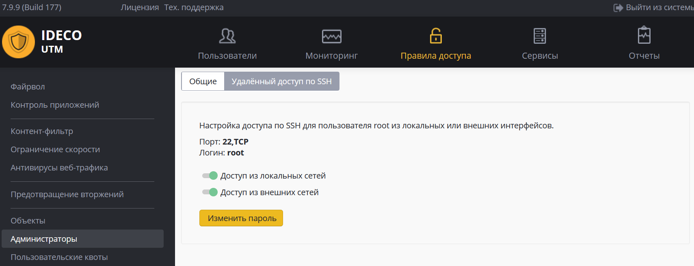

# Удаленный доступ по SSH

Доступ по SSH к серверу может быть включен для локальной сети или для
внешних сетей (не рекомендуется).

Доступ осуществляется по 22 TCP-порту.

Попытки побора паролей блокируются автоматически.

Используйте команду **ideco-local-menu** для запуска меню, команду
**mc** – для запуска файлового менеджера.

Подробнее о настройке подключения к веб-интерфейсу при удаленном доступе
смотрите в статье: [Удаленный доступ для управления сервером](./Удаленный_доступ_для_управления_сервером.md)

## Attachments:

[SSH.JPG](attachments/6586932/8388615.jpg) (image/jpeg)  

[ssh799.PNG](attachments/6586932/24182785.png) (image/png)  

