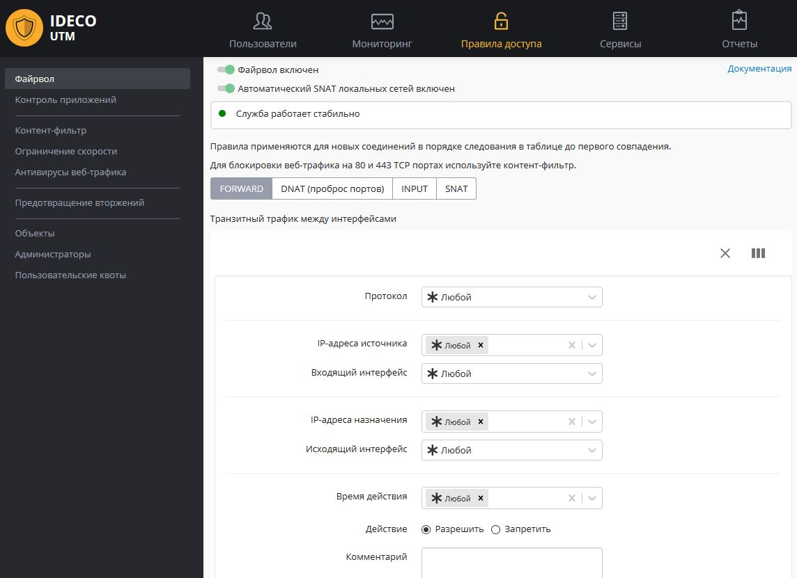

# Файрвол

## /\*\*/ Принцип работы Автоматический SNAT локальных сетей Таблицы файрвола Протоколы Правила файрвола Параметры правил файрвола Действие Создание правил Примеры правил и техник Портмаппинг, DNAT, публикация сервера в локальной сети Блокировка различных ресурсов средствами файрвола

## Принцип работы

Одним из основных средств управления трафиком на сервере является
файрвол (межсетевой экран). С его помощью можно по различным
критериям ограничивать трафик пользователей, проходящий через
сервер из локальной сети во внешние или между разными локальными
интерфейсами сервера, а также входящий трафик на сам сервер

Принцип работы брандмауэра заключается в анализе заголовков пакетов,
проходящих через интерфейсы сервера. Эта низкоуровневая задача
решается шлюзом на основе стека протоколов TCP/IP. Поэтому
брандмауэр хорошо подходит для определения глобальных правил
управления трафиком по сетевым протоколам, портам, принадлежности к
определенным IP-сетям и другим критериям, основанным на значениях полей
в заголовках сетевых пакетов.

Сетевой экран не предназначен для решения задач, связанных с контролем
доступа к ресурсам сети Интернет, исходя из адреса URL, доменного
имени или типа контента на веб-сайтах. Эти задачи более высокого
уровня, как правило, касающиеся веб-трафика, нужно решать с помощью
модуля контентной фильтрации.

Настройка файрвола доступна в разделе веб-интерфейса ***Правила* доступа
- Файрвол.**

Обратите внимание, что кроме доступного для пользователя файервола, в
Ideco UTM присутствуют преднастроенные и автоматически включаемые
системные правила. Они обеспечивают защиту служб сервера
(почтового, прокси и обратного прокси-сервера и других) - как
правило нет необходимости дополнительно настраивать защиту сервера
Ideco UTM с помощью пользовательских правил. Используйте их для
фильтрации трафика локальной сети и публикации ресурсов.

Даже при отключении пользовательского файервола в веб-интерфейсе,
системные правила продолжают работу.

В случае создания некорректных правил (например, запрещающий доступ в
веб-интерфейс Ideco UTM), вы можете отключить пользовательский
файрвол из локального меню сервера. Правила доступа -
Пользовательский файрвол.

## Автоматический SNAT локальных сетей

NAT (от англ. Network Address Translation — «преобразование сетевых
адресов») — это механизм в сетях TCP/IP, позволяющий
преобразовывать IP-адреса транзитных пакетов.
[Подробнее](https://ru.wikipedia.org/wiki/NAT).

Параметр "Автоматический SNAT локальных сетей" включает в файерволе
автоматические правила NAT для локальных сетей. Таким образом вам
не нужно создавать такие правила вручную (и изменять их при добавлении
или изменении локальных сетей).

Отключите данную настройку, если есть необходимость доступа с каких-то
внешних сетей (например ведомственных, либо DMZ) до локальной сети
Ideco UTM без NAT.

Таким образом вы сможете создать правила SNAT вручную для тех, кому он
необходим и отключить (правилом неSNAT) для тех, кого необходимо
допустить в сеть без сетевой трансляции адресов.

## Таблицы файрвола

Для удобства управления правилами в интерфейсе они разбиты на четыре
таблицы.

**FORWARD **- правила в данной таблице действуют на трафик, проходящий
между интерфейсами сервера (и соответственно сетью Интернет и
локальной сетью, а также между локальными сетями). Это основная
таблица, в которую могут быть добавлены правила ограничивающие трафик
пользователей.

**DNAT (проброс портов)** - правила этой таблицы используются для
прямого перенаправления портов с внешнего интерфейса на
определенные ресурсы в локальной сети. Такие правила часто
называются правилами проброса портов, port forwarding, portmapper.

**INPUT** - таблица для правил входящего трафика на интерфейсы сервера.
Как правило это трафик для служб сервера (например, почтового сервера).

**SNAT** - таблица правил для управления трансляцией сетевых адресов.

Правила в таблицах имеют приоритет сверху вниз (т.е. верхнее правило
приоритетнее нижнего).

## Протоколы

Брандмауэр определяет популярные сетевые протоколы путем чтения данных
из заголовков пакета. При выборе протоколов TCP и UDP появляется
возможность указания портов для источника и назначения. Порты
можно выбрать из списка или ввести вручную. Допускается ввод
нескольких портов через запятую. В этом случае порты будут
проверяться по принципу "ИЛИ". Для указания любого порта выберите
"Любой". Перечень доступных для управления в правилах протоколов
представлен в таблице ниже.

Сетевые протоколы 

UDP

Является одним из самых простых протоколов транспортного уровня модели
OSI. Его IP-идентификатор – 0x11. В отличие от TCP, UDP не гарантирует
доставку пакета, поэтому аббревиатуру иногда расшифровывают как
Unreliable Datagram Protocol (протокол ненадёжных датаграмм). Это
позволяет ему гораздо быстрее и эффективнее доставлять данные для
приложений, которым требуется большая пропускная способность линий связи
или требуется малое время доставки данных.

TCP

Выполняет функции протокола транспортного уровня модели OSI.

ICMP

В основном ICMP используется для передачи сообщений об ошибках и других
исключительных ситуациях, возникших при передаче данных. Также на ICMP
возлагаются некоторые сервисные функции.

GRE

Основное назначение протокола – инкапсуляция пакетов сетевого уровня
сетевой модели OSI в IP-пакеты. Номер протокола в IP – 47. В
основном используется при создании VPN (Virtual Private
Network).

ESP

Протокол защиты передаваемых данных в IPsec.

AH

Протокол защиты передаваемых данных в IPsec.

## Правила файрвола

**По-умолчанию используется политика "разрешить"**. Если вы не создадите
запрещающих правил, все порты и протоколы для пользователей будут
разрешены.

### Параметры правил файрвола

Параметры правил файрвола

Протокол

Протокол передачи данных (UDP/TCP/ICMP/GRE/ESP/AH либо "Любой").

IP-адрес источника

Адрес источника трафика (src), проходящего через шлюз. В этом поле могут
быть указаны IP-адреса, диапазоны IP-адресов, сети или домены - данные
берутся из Объектов, заданных пользователем.Также в качестве источника
могут использоваться пользователи и группы (при смене их IP-адресов,
файрвол автоматически это учтет).

Входящий интерфейс

Интерфейс, в который входит трафик.

IP-адрес назначения

Адрес назначения трафика (dst), проходящего через шлюз. В этом поле
могут быть указаны IP-адреса, диапазоны IP-адресов, сети или домены
- данные берутся из Объектов, заданных пользователем.Также в качестве
назначения могут использоваться пользователи и группы (при смене их
IP-адресов, файрвол автоматически это учтет).

Порт назначения 

В случае создания правила с протоколами TCP/UDP, возможно указать порт
назначения. Это может быть отдельный порт, список портов или диапазон
портов, определенные в "Объектах".

Исходящий интерфейс

Интерфейс, через который будет выходить трафик, попадающий под данное
правило.

Время действия

Время действия правила. Временные промежутки (например "рабочее время")
определяются в "Объектах"

Комментарий 

Любой текст, объясняющий цель действия правила.

### Действие

Значения этого параметра описаны в следующей таблице.

| Значения            | Описание                                                                                                                                                                                                                                                                                                                                                                                                                                      |
| ------------------- | --------------------------------------------------------------------------------------------------------------------------------------------------------------------------------------------------------------------------------------------------------------------------------------------------------------------------------------------------------------------------------------------------------------------------------------------- |
| Запретить           | Запрещает трафик.                                                                                                                                                                                                                                                                                                                                                                                                                             |
| Разрешить           | Разрешает трафик.                                                                                                                                                                                                                                                                                                                                                                                                                             |
| DNAT                | Транслирует адреса назначения, тем самым позволяет перенаправить входящий трафик. При выборе этого действия появятся поля: "Переадресовать на адрес" и "Порт". Здесь необходимо указать адрес и, опционально, порт назначения на целевом устройстве. Порт имеет смысл указывать, если правило описывает протокол подключения TCP или UDP. С помощью этой возможности можно прозрачно переадресовать входящий трафик на другой адрес или порт. |
| SNAT                | Транслирует адреса источника.                                                                                                                                                                                                                                                                                                                                                                                                                 |
| Не производить SNAT | Отменяет действие "SNAT" (в файрвол выше по списку) для трафика, удовлетворяющего критериям правила.                                                                                                                                                                                                                                                                                                                                          |
| Не производить DNAT | Отменяет действие "DNAT" (в файрвол выше по списку) для трафика, удовлетворяющего критериям правила.                                                                                                                                                                                                                                                                                                                                          |

### Создание правил

Перед созданием правил для сетей, IP-адресов или диапазонов IP-адресов,
предварительно создайте их в разделе Объекты.

Для того чтобы создать правила в нужной таблице, нажмите кнопку "+".

Укажите необходимые параметры и действия правила и нажмите кнопку
"Сохранить". Правило будет добавлено вниз таблицы. Измените его
приоритет, в случае если это необходимо.

Особенность по созданию правил для фильтрации веб-трафика (80, 443 TCP
порты): т.к. в Ideco UTM на данных портах работает служба прозрачного
прокси-сервера, правила в таблице FORWARD для данных портов будут
работать только если добавить IP-адреса удаленных ресурсов в
исключения [прокси-сервера](./Прокси.md). Для фильтрации веб-трафика
рекомендуется использовать правила [контент-фильтра](./Контент-фильтр.md).

**После создания правил, изменения их приоритета в таблицах, включения
или отключения правил - правила начинают действовать практически
мгновенно.**

## Примеры правил и техник

### Портмаппинг, DNAT, публикация сервера в локальной сети

Этот пример подробно описан в соответствующей
[статье](./Портмаппинг_проброс_портов_DNAT_.md) в
разделе **Публикация ресурсов**.

### Блокировка различных ресурсов средствами файрвола

Вопросы блокировки различных ресурсов: программ удаленного управления
(AmmyAdmin и TeamViewer), месенджеров и другого ПО описаны в отдельной
[статье](./Блокировка_популярных_ресурсов.md).

## Attachments:

[firewall01.JPG](attachments/1278113/11239467.jpg) (image/jpeg)  

